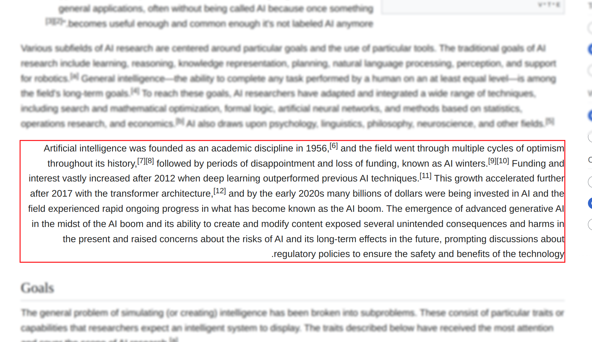
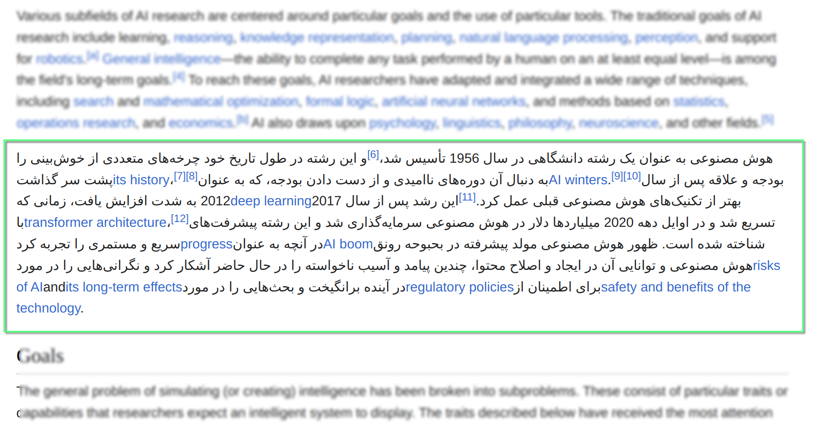

# AI Writing Companion

> دستیار هوشمند ترجمه

<p align="center">
  <a href="#install-for-chrome">
    
    <span>&nbsp;Chrome&nbsp;</span>
  </a>
  <a href="#install-for-edge">
    
    <span>&nbsp;Edge&nbsp;</span>
  </a>
  <a href="#install-for-firefox">
    
    <span>&nbsp;Firefox&nbsp;</span>
  </a>

✅ در دسترس

</p>

<br>

---

<div dir="rtl" style="text-align: right;">

<br>

<div align="center">
    <strong>
        • <a href="./README.md">English</a> | 
        • <a href="./README.FA.md">فارسی</a>
    </strong>
</div>

<br>

این افزونه یک ابزار سبک و کارآمد برای ترجمه متون در صفحاتِ وب و همچنین متونی است که می‌نویسید. با ارائه چند روش ترجمه و جستجوی لغت، تجربه‌ای سریع و بی‌دردسر را فراهم می‌کند.

- **ترجمه با انتخاب متن:** به راحتی یک متن را انتخاب کنید تا کادر ترجمه در آنجا نمایان شود.

<p align="center">
  
</p>

- **ترجمه با انتخاب قسمتی از صفحه:** با فعال‌سازی حالت "انتخاب اِلِمان" از طریق آیکون افزونه در نوار ابزار، می‌توانید هر بخش از صفحه (مانند پاراگراف یا دکمه) را بدون تغییر در چینش، به‌طور کامل ترجمه کنید.

<p align="center">
  
  
</p>

- **ترجمه در حین نوشتن:** وقتی در فیلدهای متنی یا فرم‌ها مشغول تایپ هستید، می‌توانید یا با فشار کلید میانبر `Ctrl + /` یا با کلیک روی آیکون مترجم کوچک کنار فیلد، متن خود را قبل از ارسال به سرعت ترجمه کنید.

<p align="center">
  
</p>

- **ترجمه پیشرفته از طریق Popup:** با کلیک روی آیکون افزونه در نوار ابزار، یک پنجره popup فعال می‌شود که علاوه بر ترجمه، امکانات بیشتری مانند بررسی تلفظ و ارائه اطلاعات دیکشنری را در اختیار قرار می‌دهد.

<p align="center">
  
</p>

این افزونه به صورت اختصاصی برای استفاده شخصی توسعه یافته و ترجمه‌ای هوشمند و سریع را همیشه در دسترس قرار می‌دهد.

**ترجمه هوشمند و سریع، همیشه و همه جا.**

<br>

<div dir="rtl" style="text-align: right;">

## ✨ ویژگی‌های کلیدی

💸 **رایگان:**
برای همیشه، کد منبع باز

🔊 **تلفظ لغات و جملات:**
همراه با هر ترجمه، امکان شنیدن تلفظ دقیق کلمات و جملات فراهم است. همچنین با انتخاب لهجه‌های مختلف، می‌توانید تلفظ مورد نظر خود را بشنوید. تنها کافیست روی آیکون مترجم در نوار ابزار کلیک کنید تا به بخش تلفظ پیشرفته دسترسی پیدا کنید.

📙 **حالت دیکشنری (Dictionary Mode):**
با انتخاب یک کلمه در صفحه، علاوه بر ترجمه، اطلاعات جامعی از قبیل معنی، مترادف‌ها، نوع کلمه و مثال‌های کاربردی نمایش داده می‌شود. این قابلیت به شما کمک می‌کند تا درک عمیق‌تری از لغات داشته باشید.

✅ **پشتیبانی از ارائه‌دهندگان ترجمه متنوع:**
این افزونه از چندین سرویس ترجمه هوش مصنوعی پشتیبانی می‌کند تا بهترین گزینه را مطابق نیازهای خود انتخاب کنید:

- [Gemini][gemini-url] (✔ رایگان)
- [OpenAI][openai-url]
- [OpenRouter][openrouter-url] (✔ رایگان)
- [WebAI to API][webai-to-api-url] (✔ رایگان)

</div>

<br>

## 📋 نیازمندی‌ها

- مرورگر مدرن مبتنی بر Chromium یا Firefox (Chrome، Edge، Brave و غیره)
- یک کلید API معتبر (در صورت عدم استفاده از [WebAI to API][webai-to-api-url])

<br>

---

## 🔧 نصب

یه کم ریزه‌کاری داره تموم بشه، بزودی توی Chrome Store و Firefox Add-ons هم منتشر می‌کنیم.

<details id="install-for-chrome">
<summary>
  <h3>نصب برای کروم</h3>
</summary>

- [از اینجا آخرین نسخه مخصوص کروم را دانلود کنید][chrome-zip-url]
- فایل ZIP دانلود شده را از حالت فشرده خارج کنید.
- آدرس [`chrome://extensions`][chrome-extensions-url] را در کروم باز کنید و **Developer mode** را فعال کنید.
- فولدر استخراج شده را به صفحه `chrome://extensions` بکشید و رها کنید تا افزونه نصب شود.
- تمام

_توجه_: بعد از نصب، با کلیک روی **آیکون افزونه** در مرورگر، به **تنظیمات** بروید و کلید **API خود** را وارد کنید.

</details>
<br>

<details id="install-for-firefox">
<summary>
  <h3>نصب برای فایرفاکس</h3>
</summary>

- [از اینجا آخرین نسخه مخصوص فایرفاکس را دانلود کنید][firefox-zip-url]
- فایل ZIP دانلود شده را از حالت فشرده خارج کنید.
- آدرس [`about:debugging#/runtime/this-firefox`][firefox-extensions-url] را در فایرفاکس بازکنید
- با انتخاب دکمه `Load Temporary Add-on...` آدرس مسیر `manifest.json` برای فایرفاکس در فولدر استخراج شده را بدهید.
- تمام!

_توجه_: بعد از نصب، با کلیک روی **آیکون افزونه** در مرورگر، به **تنظیمات** بروید و کلید **API خود** را وارد کنید.

</details>
<br>

<details id="install-for-edge">
<summary>
  <h3>نصب برای Edge</h3>
</summary>

- [از اینجا آخرین نسخه مخصوص ایج را دانلود کنید][edge-zip-url]
- فایل ZIP دانلود شده را از حالت فشرده خارج کنید.
- آدرس [`edge://extensions`][edge-extensions-url] را در Edge باز کنید و **Developer mode** را فعال کنید.
- فولدر استخراج شده را به صفحه `edge://extensions` بکشید و رها کنید تا افزونه نصب شود.
- تمام

_توجه_: بعد از نصب، با کلیک روی **آیکون افزونه** در مرورگر، به **تنظیمات** بروید و کلید **API خود** را وارد کنید.

</details>

<br>

---

## 🔑 کلیدهای API

برای استفاده نیاز به بک کلید API از ارائه‌دهندگان زیر دارید:

| ارائه‌دهنده   | دریافت کلید API                                  | هزینه                      |
| ------------- | ------------------------------------------------ | -------------------------- |
| Google Gemini | [Google AI Studio][gemini-api-key-url]           | رایگان                     |
| OpenAI        | [کلیدهای API OpenAI][openai-api-key-url]         | پولی                       |
| OpenRouter    | [کلیدهای API OpenRouter][openrouter-api-key-url] | رایگان                     |
| WebAI to API  | _(نیاز به کلید ندارد)_                           | [رایگان][webai-to-api-url] |

**توجه:** **`WebAI to API`** یک سرور python است که بدون نیاز به API میتونید API Local داشته باشید.

**توجه:** برای بچه‌های داخل ایران، احتمالا برای دریافت `API Key` رایگان مجبور باشید VPN استفاده کنید.

<br>

---

<details>
  <summary>
    <h2>⚙️ تنظیمات پیشرفته</h2>
  </summary>

در بخش تنظیمات API افزونه، برای هر ارائه‌دهنده خدمات ترجمه، تنظیمات اختصاصی وجود دارد که به شما امکان می‌دهد مدل‌های مختلف را بر اساس نیاز خود انتخاب و تنظیم کنید:

- **Google Gemini**

  در این قسمت می‌توانید آدرس `API URL` را تغییر دهید تا از مدل‌های دیگر Gemini استفاده کنید. مدل‌ها و تنظیمات مختلف در [مستندات رسمی Gemini][gemini-url-docs] توضیح داده شده‌اند. انتخاب مدل مناسب می‌تواند بر کیفیت، سرعت و هزینه ترجمه تأثیرگذار باشد.

- **OpenAI**

  در تنظیمات OpenAI، می‌توانید با وارد کردن نام مدل (مثل `gpt-4` یا `gpt-3.5-turbo`) از مدل دلخواه استفاده کنید. برای مشاهده لیست کامل مدل‌ها و اطلاعات بیشتر، به [مستندات OpenAI][openai-url-docs] مراجعه کنید. تغییر مدل می‌تواند تجربه ترجمه را از نظر دقت یا هزینه شخصی‌سازی کند.

- **OpenRouter**

  مانند OpenAI، در بخش OpenRouter نیز می‌توانید با مراجعه به [مستندات OpenRouter][openrouter-url-docs]، مدل مورد نظر خود را انتخاب کرده و نام آن را در تنظیمات وارد کنید. OpenRouter از چندین مدل مختلف پشتیبانی می‌کند و امکان انعطاف‌پذیری بیشتری به شما می‌دهد.

- **WebAI to API**

  این نرم‌افزار، یک API محلی (local) و رایگان است که نیازی به کلید ندارد. می‌توانید مدل‌های دلخواه خود را در تنظیمات آن تعریف کنید. برای آشنایی با نحوه پیکربندی و مدل‌های قابل استفاده، به [مستندات WebAI to API][webai-to-api-url-docs] مراجعه نمایید.

<br>

> تنظیم مدل‌ها این امکان را می‌دهد تا بین هزینه، کیفیت، و سرعت ترجمه، تعادل مناسب را انتخاب کنید.
> ساختار و پرامت‌های نوشته شده با تنظیمات حداقلی هر کدام از ارایه دهندگان انجام شده.
> یعنی اگر مدل‌های بهتر را انتخاب کنید، کیفیت ترجمه هم تاثیر گذار خواهد بود. بصورت پیش‌فرض
> نیازی به تنظیمات اضافی نیست، کیفیت ترجمه خوب و قابل قبولی را ارایه میدهد.

<br>

_نکته:_ برای `OpenAI` و `OpenRouter` بصورت پیش‌فرض از `gpt-3.5-turbo` استفاده می‌شود.

_نکته:_ برای `Google Gemini` و `WebAI to API` بصورت پیش‌فرض از `gemini-2.0-flash` استفاده می شود.

<br>

</details>

---

## ☕ مهمونم کنید

اگر این پروژه براتون مفید بود، یه قهوه مهمونم کنید : )

<br>

| روش‌های دونیت       | 🔗 لینک                                                                                                                                                            |
| ------------------- | ------------------------------------------------------------------------------------------------------------------------------------------------------------------ |
| **USDT (Ethereum)** | `0x76DAF7D7C3f7af9B90e16B5C25d063ff3A1A0f8f`                                                                                                                       |
| **Bitcoin (BTC)**   | `bc1qgxj96s6nks6nyhzlncw65nnuf7pyngyyxmfrsw`                                                                                                                       |
| **PayPal**          | [](https://www.paypal.com/donate/?hosted_button_id=DUZBXEKUJGKLE) |

<br>

با تشکر از حمایت شما!

<br>

---

### 👥 مشارکت‌کنندگان

- iSegar0 [-iSegar0-blue?style=flat&logo=x>)](https://x.com/iSegar0/)
- Mohammad [-M_Khani65-blue?style=flat&logo=x>)](https://x.com/M_Khani65/)

<br>

---

## 🥤 توسعه

### پیش‌نیازها

مطمئن شوید [**Node.js**][node-js-url] نصب است (که شامل `npm` می‌شود)، بعدش توی ترمینال دستور زیر را بنویسید:

_نکته: من در این پروژه از [`pnpm`][pnpm-url] استفاده می‌کنم. دستورات ارائه شده با همین ساختار `pnpm` نیز قابل اجرا هستند._

<div dir="ltf" style="text-align: left;">

```bash
cd AI-Writing-Companion
npm install
```

</div>

### ساخت

برای تولید فایل‌های افزونه، از دستورات `build` زیر می توانید استفاده کنید:

<div dir="ltf" style="text-align: left;">

```bash
npm run build

npm run build:chrome
npm run build:firefox
npm run build:edge

```

</div>

این دستور فایل‌های `zip` مربوط به هر مرورگر را برای نصب به صورت دستی، در مسیر `AI-Writing-Companion/Build-Extension/` آماده میکنه.

ولی اگه میخواهید تو لحظه تغییراتی بدهید، یکی از ۳ دستور زیر بیشتر به کارتون میاد:

<div dir="ltf" style="text-align: left;">

```bash
npm run watch

npm run watch:chrome
npm run watch:firefox
```

</div>

<br>

---

## 🤝 همکاری

- ⭐ **به این پروژه ستاره بدید** تا از پروژه پشتیبانی کنید.
- 🐞 **مشکلات را گزارش دهید:** [مشکلات GitHub][github-issues-url]
- 📝 **ارسال Pull Request (PR):** تا در بهبود پروژه مشارکت کنید.

---

### 🖼️ حقوق آثار

آیکون‌های استفاده‌شده در این پروژه از وب‌سایت [Flaticon](https://www.flaticon.com) هستند و توسط طراحان زیر ایجاد شده‌اند:

-  — [Pixel perfect](https://www.flaticon.com/authors/pixel-perfect) (آیکون اصلی)
-  — [Pixel perfect](https://www.flaticon.com/authors/pixel-perfect) (انتخاب)
-  — [Pixel perfect](https://www.flaticon.com/authors/pixel-perfect) (چسباندن)
-  — [Tanah Basah](https://www.flaticon.com/free-icons/voice-command) (فرمان صوتی)
-  — [photo3idea_studio](https://www.flaticon.com/free-icons/translate) (ترجمه)
-  — [Midev](https://www.flaticon.com/free-icons/clear) (پاک کردن)
-  — [Miftakhul Rizky](https://www.flaticon.com/free-icons/close) (بستن)
-  — [Freepik](https://www.flaticon.com/authors/freepik) (تغییر جای)
-  — [Freepik](https://www.flaticon.com/authors/freepik) (تنظیمات)
-  — [Catalin Fertu](https://www.flaticon.com/free-icons/copy) (کپی)
-  — [KP Arts](https://www.flaticon.com/free-icons/revert) (بازگشت)

<br>

---

## 📜 مجوز

این پروژه تحت **مجوز MIT** است. آزادانه بهبود دهید و به اشتراک بگذارید!

[gemini-url]: https://gemini.com/
[openai-url]: https://chat.openai.com/
[openrouter-url]: https://openrouter.ai/
[webai-to-api-url]: https://github.com/Amm1rr/WebAI-to-API/
[firefox-zip-url]: https://github.com/iSegaro/AIWritingCompanion/raw/refs/heads/main/Build-Extension/AI-Writing-for-Firefox-v0.1.0.zip
[chrome-zip-url]: https://github.com/iSegaro/AIWritingCompanion/raw/refs/heads/main/Build-Extension/AI-Writing-for-Chrome-v0.1.0.zip
[edge-zip-url]: https://github.com/iSegaro/AIWritingCompanion/raw/refs/heads/main/Build-Extension/AI-Writing-for-Edge-v0.1.0.zip
[chrome-extensions-url]: chrome://extensions/
[edge-extensions-url]: edge://extensions/
[firefox-extensions-url]: about:debugging#/runtime/this-firefox/
[gemini-api-key-url]: https://aistudio.google.com/apikey/
[openai-api-key-url]: https://platform.openai.com/api-keys/
[openrouter-api-key-url]: https://openrouter.ai/settings/keys/
[mohammad-x-url]: https://x.com/m_khani65/
[github-issues-url]: https://github.com/iSegaro/AIWritingCompanion/issues/
[isegaro-x-url]: https://x.com/iSegar0/
[m-khani65-x-url]: https://x.com/M_Khani65/
[flaticon-url]: https://www.flaticon.com/free-icons/translate/
[gemini-url-docs]: https://ai.google.dev/api/all-methods/
[openai-url-docs]: https://platform.openai.com/docs/models/
[openrouter-url-docs]: https://openrouter.ai/models/
[webai-to-api-url-docs]: https://github.com/Amm1rr/WebAI-to-API/
[pnpm-url]: https://pnpm.io/
[node-js-url]: https://nodejs.org/

</div>
