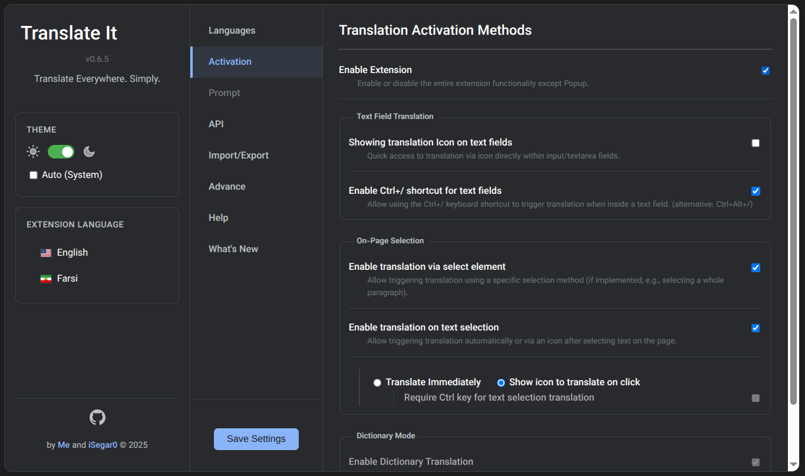
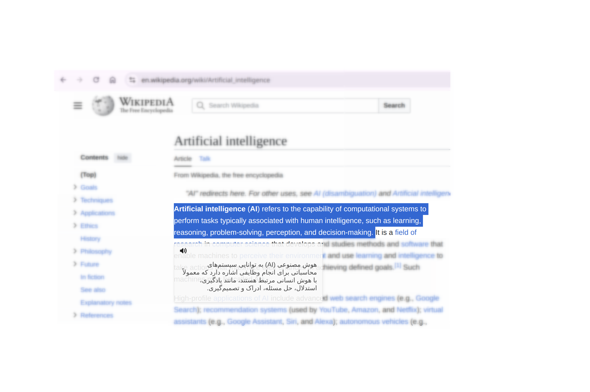
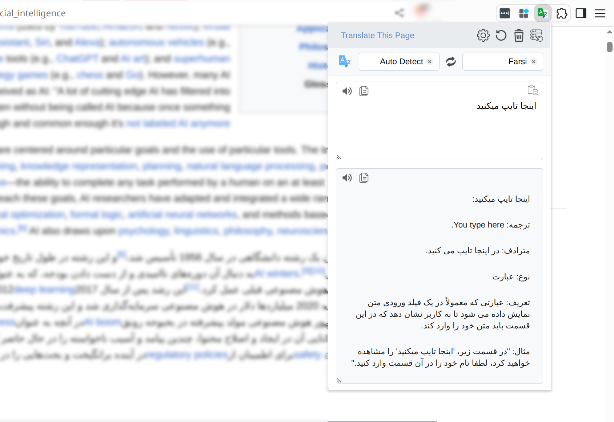

# Translate It!

> Smart Translation Assistant - Web Extension

<p align="center">
  <a target="_blank" href="https://chromewebstore.google.com/detail/AI%20Writing%20Companion%20for%20Chrome/jfkpmcnebiamnbbkpmmldomjijiahmbd/">
    
  </a>
  <a target="_blank" href="https://addons.mozilla.org/en-GB/firefox/addon/ai-writing-companion/">
    
  </a>

</p>

<br>

---

<br>

<div align="center">
  <strong>
    • <a href="./README.md">English</a> | 
    • <a href="./README_FARSI.md">فارسی</a>
  </strong>
</div>

<br>

<p align="center">
  
</p>

<br>

This is a lightweight and efficient personal tool for translating text on websites and even the text you write yourself. With multiple methods for translation and word lookup, it offers a fast and seamless experience:

- **Text Selection Translation:** Simply select any text, and the translation box will appear right where you selected.

Alternatively, a small translation icon can appear below the selected text—clicking it will show the translation.

  <p align="center">
    
    
  </p>

- **Element Selection Translation:** Activate `Select Element` mode from the extension icon. Then click on any part of the page (e.g., paragraph or button) to translate it entirely, without breaking the page layout.

<p align="center">
  
  
  
</p>

- **In-Field Translation:** When typing inside a form or text field, press the `Ctrl + /` shortcut or click the inline translator icon to instantly translate the content before sending.

<p align="center">
  
</p>

- **Advanced Popup Translation:** Clicking the extension icon opens a popup with extended features such as multi-accent pronunciation and dictionary support.

<p align="center">
  
</p>

This extension is developed solely for personal use and keeps smart and fast translation always within reach.

**Smart and fast translation, anytime, anywhere.**

<br>

## ✨ Key Features

💸 **Free & Open Source:**  
Always free, powered by open-source code.

🔊 **Word and Sentence Pronunciation:**  
Each translation comes with audio playback for accurate pronunciation. You can also choose from different accents. Click the extension icon to access advanced pronunciation options.

📙 **Dictionary Mode:**  
When selecting a word, you'll not only get a translation but also helpful information like definitions, synonyms, word type, and usage examples.

🎬 **Video Subtitle Translation:**  
Automatically translates video subtitles on YouTube and Netflix in real-time. The extension detects when subtitles are available and provides instant translation without interrupting your viewing experience.

✅ **Supports Multiple Translation Providers:**  
You can choose from several AI-powered translation providers:

- [Google Translate][google-translate-url] (✔ Free)
- [Gemini][gemini-url] (✔ Free)
- [WebAI to API][webai-to-api-url] (✔ Free)
- [OpenRouter][openrouter-url]
- [OpenAI][openai-url]
- [DeepSeek][deepseek-url]
- Custom OpenAI Compatible (refrence to [Advanced Settings](#advanced-settings))

<br>

## 📋 Requirements

- A modern Chromium-based browser or Firefox (Chrome, Edge, Brave, etc.)
- A valid API key (unless using [Google Translate][google-translate-url] or [WebAI to API][webai-to-api-url])

<br>

---

## 🔧 Download & Install

<p align="center">
  <a target="_blank" href="https://chromewebstore.google.com/detail/AI%20Writing%20Companion%20for%20Chrome/jfkpmcnebiamnbbkpmmldomjijiahmbd/">
    
  </a>
  <a target="_blank" href="https://addons.mozilla.org/en-GB/firefox/addon/ai-writing-companion/">
    
  </a>

</p>

<details id="manual-install">
<summary>
Manual Installation
</summary>

<details id="install-for-chrome">
<summary>
  <h3>Install Translate It Web Extension for Chrome</h3>
</summary>

- [Download the latest Chrome version here][chrome-zip-url].
- Extract the downloaded ZIP file.
- Open [`chrome://extensions/`][chrome-extensions-url] and enable **Developer mode**.
- Drag the extracted folder into the page to install the extension.
- Done!

_Note:_ After installation, click the **extension icon**, go to **Settings**, and enter your **API Key**.

</details>

<br>

<details id="install-for-firefox">
<summary>
  <h3>Install Translate It Web Extension for Firefox</h3>
</summary>

- [Download the latest Firefox version here][firefox-zip-url].
- Extract the downloaded ZIP file.
- Open [`about:debugging#/runtime/this-firefox/`][firefox-extensions-url].
- Click `Load Temporary Add-on...` and select the `manifest.json` file from the extracted folder.
- Done!

_Note:_ After installation, click the **extension icon**, go to **Settings**, and enter your **API Key**.

</details>

</details>

<br>

---

## 🔑 API Keys

To use AI-based translation, you’ll need an API key from one of the providers listed below:

| Provider         | How to Get API Key                            | Cost |
| ---------------- | --------------------------------------------- | ---- |
| Google Translate | _Dont Need_                                   | Free |
| Google Gemini    | [Google AI Studio][gemini-api-key-url]        | Free |
| WebAI to API     | _[Local Server][webai-to-api-url]_            | Free |
| OpenRouter       | [OpenRouter API Keys][openrouter-api-key-url] | Free |
| OpenAI           | [OpenAI API Keys][openai-api-key-url]         | Paid |
| DeepSeek         | [DeepSeek API Keys][deepseek-api-key-url]     | Paid |
| Custom OpenAI    | -                                             | -    |

**Note:** `WebAI to API` is a local Python-based server that allows you to use AI translation without an API key.

**Important:** If you're in Iran, you may need a VPN to access and register for free API keys.

<br>

---

<details>
<summary>
  <h2>🪶 How to Use</h2>
</summary>

1. **Add the Extension to Your Browser**

   After installation, pin the extension to your browser toolbar for quick and easy access.

2. **Activate "Element Selection Mode"**

   To translate any specific part of a web page, you first need to activate `Element Selection Mode`. You can do this using one of the following methods:

   - Click on the extension icon and select the relevant option.
   - Right-click anywhere on the page and choose the option from the context menu.
   - Or [use the keyboard shortcut](#keyboard-shortcuts) for faster access.

3. **Translate Text by Clicking an Element**

   Once the mode is active, hover over any part of the page to highlight it. Click the highlighted area to instantly translate its content.

4. **Revert Translations**

   To undo translations and restore the original text, use either of the following methods:

   - Press the `ESC` key.
   - Click the `Revert` button from within the extension popup.

5. **Translation Cache**

   When you translate and then revert a piece of text, its translation is cached. On subsequent translations, the cached result will be shown instantly.
   A small "From Cache" label will appear temporarily in the top-right corner of the page.

6. **Clear the Translation Cache**

   To force a fresh translation from the server, click the "From Cache" label. This will clear the cached entry for that element.

---

### <div id="keyboard-shortcuts">Keyboard Shortcuts</div>

To quickly activate `Element Selection Mode`, you can use configurable keyboard shortcuts.
We recommend setting them manually to avoid conflicts with browser or system shortcuts.

#### Customize Shortcuts:

You can modify the default shortcuts as needed:

- **In Chrome**:  
  Go to [`chrome://extensions/shortcuts`](chrome://extensions/shortcuts)

- **In Firefox**:

  1. Right-click on the extension icon in the toolbar and choose `Manage Extension`.
  2. In the opened page, click the gear icon.
  3. Select `Manage Extension Shortcuts`.

</details>

<br>

---

<details id="advanced-settings">
<summary>
  <h2>⚙️ Advanced Settings</h2>
</summary>

In the API Settings page of the extension, each provider has customizable options to let you choose and configure different models:

- **Google Gemini**

  You can change the `API URL` to use different Gemini models. For available models and usage info, see [Gemini official documentation][gemini-url-docs]. Choosing the right model may improve translation quality, speed, or reduce API cost.

- **OpenAI**

  You can select models like `gpt-4`, `gpt-3.5-turbo`, and more by entering their names in the settings. Visit [OpenAI docs][openai-url-docs] for the full list. This allows you to customize translation quality vs. cost.

- **OpenRouter**

  Similar to OpenAI, OpenRouter supports a variety of models. You can pick one from the list at [OpenRouter documentation][openrouter-url-docs] and use it by name.

- **DeepSeek**

  You can also add the model in the settings on DeepSeek by referring to the [DeepSeek documentation][deepseek-url-docs].

- **WebAI to API**

  This is a free local backend for translation. You can configure your own model in the settings. For setup, see [WebAI to API GitHub repo][webai-to-api-url-docs].

- **Custom (OpenAI Compatible)**

  For maximum flexibility, this option lets you connect to any API service that uses the OpenAI chat completions format. Simply enter the custom `API URL`, `API Key`, and `Model Name` in the settings. This is ideal for using self-hosted models, local LLMs (e.g., through Ollama), or other compatible third-party providers. For the required format, see the [OpenAI API reference][openai-url-docs].

> These options let you balance between cost, quality, and speed.  
> The extension uses default models with minimum setup required — but upgrading the model will improve translation results.

**Default models used:**

- For `OpenAI` and `OpenRouter`: `gpt-3.5-turbo`
- For `Google Gemini` and `WebAI to API`: `gemini-2.0-flash`
- For `DeepSeek`: `deepseek-chat`

</details>

<br>

---

<details>
<summary>
  <h2>☕ Buy Me a Coffee</h2>
</summary>

If this project helped you and you’d like to support it, you can buy me a coffee ☕

<br>

| Donation Method     | 🔗 Link                                                                                                                                                                                                                 |
| ------------------- | ----------------------------------------------------------------------------------------------------------------------------------------------------------------------------------------------------------------------- |
| **BuyMeACoffee**    | <a href="https://www.buymeacoffee.com/m_khani" target="_blank"></a> |
| **USDT (Ethereum)** | `0x76DAF7D7C3f7af9B90e16B5C25d063ff3A1A0f8f`                                                                                                                                                                            |
| **Bitcoin (BTC)**   | `bc1qgxj96s6nks6nyhzlncw65nnuf7pyngyyxmfrsw`                                                                                                                                                                            |
| **PayPal**          | [](https://www.paypal.com/donate/?hosted_button_id=DUZBXEKUJGKLE)                                                      |

</details>

<br>
Thank you for your support!

<br>

---

### 👥 Contributors

- iSegar0 [-iSegar0-blue?style=flat&logo=x>)](https://x.com/iSegar0/)
- Mohammad [-M_Khani65-blue?style=flat&logo=x>)](https://x.com/M_Khani65/)

<br>

---

<details>
<summary>
  <h2>🥤 Development Notes</h2>
</summary>

### Prerequisites

Make sure [**Node.js**][node-js-url] and [**pnpm**][pnpm-url] are installed. Then, clone the repository and install the dependencies:

```bash
git clone https://github.com/iSegar0/Translate-It.git
cd Translate-It
pnpm install
```

### Initial Setup

After installing dependencies, run the setup command to ensure all development tools are configured:

```bash
pnpm run setup
```

This will configure the development environment and install any additional tools needed for validation.

### Building for Development

To generate the unpacked extension files for development, run:

```bash
# Build for both browsers
pnpm run build

# Build for a specific browser
pnpm run build:chrome
pnpm run build:firefox
```

This will create the necessary files in the `Build-Extension/Chrome/` and `Build-Extension/Firefox/` directories, which you can load as temporary extensions in your browser.

To actively develop and apply changes in real time, use one of the following commands:

```bash
# Watch for changes for both browsers
pnpm run watch:chrome
pnpm run watch:firefox
```

### Code Quality and Validation

#### Linting

To ensure code quality and catch potential issues early, you can run ESLint:

```bash
# Lint source code for both browsers
pnpm run lint

# Lint for specific browser
pnpm run lint:source:chrome
pnpm run lint:source:firefox
```

This command will scan all `src/**/*.js` files and report any syntax errors or unsafe patterns.

#### Extension Validation

Validate the built extensions to ensure they meet browser store requirements:

```bash
# Validate both browsers
pnpm run validate

# Validate specific browsers
pnpm run validate:firefox
pnpm run validate:chrome
```

**Note:** For Chrome validation, you need web-ext installed. If it's not available, install it with:

```bash
pnpm run setup:chrome-validator
```

#### Pre-submission Workflow

Before submitting your changes, run the comprehensive pre-submission check:

```bash
pnpm run pre-submit
```

This command runs linting, builds the extension, and validates both browser versions.

### Packaging for Distribution

When you are ready to create distributable packages, use the following commands.

**To package the source code:**

This command creates a `.zip` archive of the project's source files, named `Source-vX.X.X.zip`.

```bash
pnpm run source
```

**To create a full release:**

This command bundles everything. It creates the source code archive and builds the final, installable `.zip` packages for both browsers.

```bash
pnpm run publish
```

After running, the `Build-Extension/Publish` directory will contain:

- `Source-vX.X.X.zip`
- `Translate-It-vX.X.X-for-Chrome.zip`
- `Translate-It-vX.X.X-for-Firefox.zip`

</details>

<br>

---

## 🤝 Contributing

- ⭐ **Star the repo** to support the project.
- 🐞 **Report issues** via [GitHub Issues][github-issues-url].
- 📝 **Submit a Pull Request (PR)** to help improve the extension.

<br>

---

<details>
<summary>
  <h2>🖼️ Icons Credit</h2>

Icons used in this project are provided by [Flaticon](https://www.flaticon.com) and created by:

</summary>

-  — [Pixel perfect](https://www.flaticon.com/authors/pixel-perfect) (Main icon)
-  — [Pixel perfect](https://www.flaticon.com/authors/pixel-perfect) (Select)
-  — [Pixel perfect](https://www.flaticon.com/authors/pixel-perfect) (Paste)
-  — [Tanah Basah](https://www.flaticon.com/free-icons/voice-command) (Voice Command)
-  — [photo3idea_studio](https://www.flaticon.com/free-icons/translate) (Translate)
-  — [Midev](https://www.flaticon.com/free-icons/clear) (Clear)
-  — [Miftakhul Rizky](https://www.flaticon.com/free-icons/close) (Close)
-  — [Freepik](https://www.flaticon.com/authors/freepik) (Swap)
-  — [Freepik](https://www.flaticon.com/authors/freepik) (Settings)
-  — [Catalin Fertu](https://www.flaticon.com/free-icons/copy) (Copy)
-  — [KP Arts](https://www.flaticon.com/free-icons/revert) (Revert)
-  — [KP Arts](https://www.flaticon.com/free-icons/app) (Side Panel)

</details>

<br>

---

## Star History

<a href="https://www.star-history.com/#iSegaro/Translate-It&Date">
 <picture>
   <source media="(prefers-color-scheme: dark)" srcset="https://api.star-history.com/svg?repos=iSegaro/Translate-It&type=Date&theme=dark" />
   <source media="(prefers-color-scheme: light)" srcset="https://api.star-history.com/svg?repos=iSegaro/Translate-It&type=Date" />
   
 </picture>
</a>

<br>

---

## 📜 License

This project is licensed under the **MIT License** — feel free to modify and share!

year 2025

[google-translate-url]: https://translate.google.com/
[gemini-url]: https://gemini.com/
[openai-url]: https://chat.openai.com/
[deepseek-url]: https://chat.deepseek.com/
[openrouter-url]: https://openrouter.ai/
[webai-to-api-url]: https://github.com/Amm1rr/WebAI-to-API/
[firefox-store]: https://addons.mozilla.org/en-GB/firefox/addon/ai-writing-companion/
[chrome-store]: https://chromewebstore.google.com/detail/AI%20Writing%20Companion%20for%20Chrome/jfkpmcnebiamnbbkpmmldomjijiahmbd/
[firefox-zip-url]: https://github.com/iSegaro/Translate-It/tree/main/Build-Extension/Publish/
[chrome-zip-url]: https://github.com/iSegaro/Translate-It/tree/main/Build-Extension/Publish/
[chrome-extensions-url]: chrome://extensions/
[firefox-extensions-url]: about:debugging#/runtime/this-firefox/
[gemini-api-key-url]: https://aistudio.google.com/apikey/
[openai-api-key-url]: https://platform.openai.com/api-keys/
[deepseek-api-key-url]: https://platform.deepseek.com/api-keys/
[openrouter-api-key-url]: https://openrouter.ai/settings/keys/
[mohammad-x-url]: https://x.com/m_khani65/
[github-issues-url]: https://github.com/iSegaro/AIWritingCompanion/issues/
[isegaro-x-url]: https://x.com/iSegar0/
[m-khani65-x-url]: https://x.com/M_Khani65/
[flaticon-url]: https://www.flaticon.com/free-icons/translate/
[gemini-url-docs]: https://ai.google.dev/api/all-methods/
[openai-url-docs]: https://platform.openai.com/docs/models/
[deepseek-url-docs]: https://api-docs.deepseek.com/api/list-models/
[openrouter-url-docs]: https://openrouter.ai/models/
[webai-to-api-url-docs]: https://github.com/Amm1rr/WebAI-to-API/
[pnpm-url]: https://pnpm.io/
[node-js-url]: https://nodejs.org/
