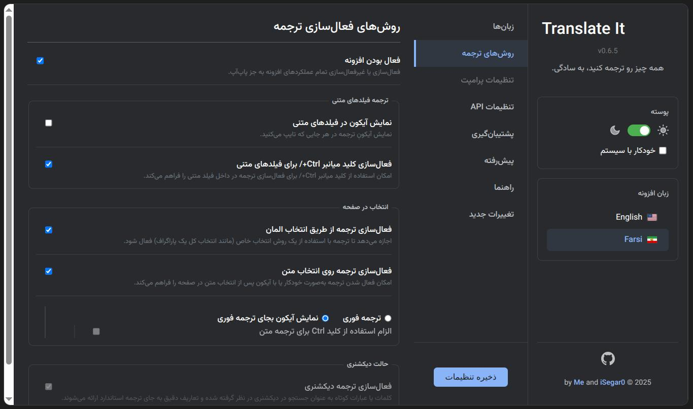
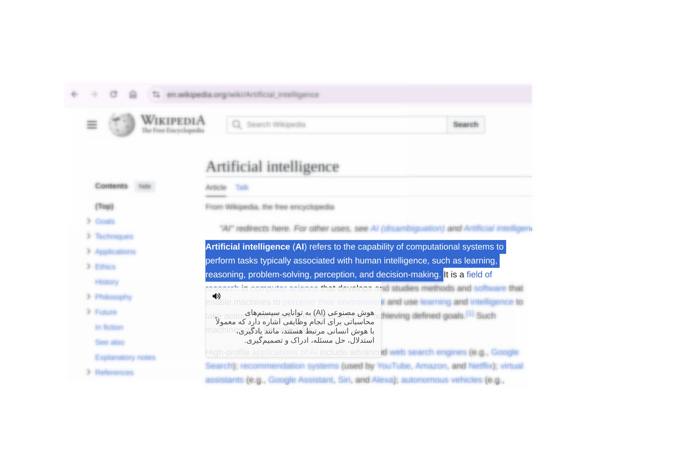
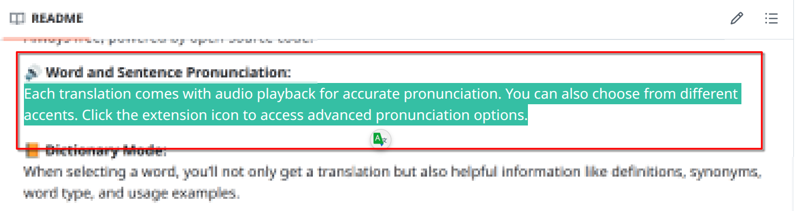
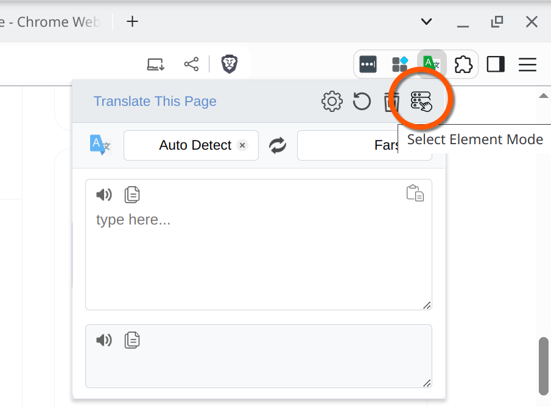
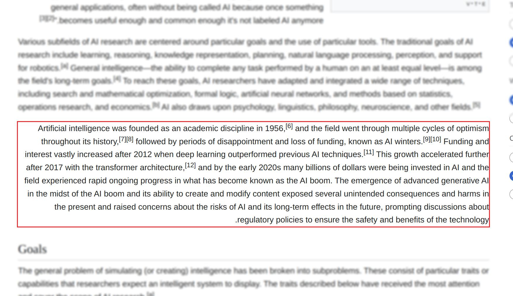
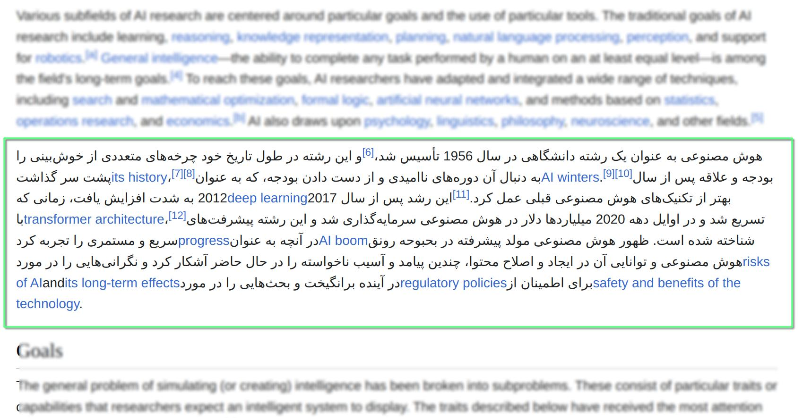
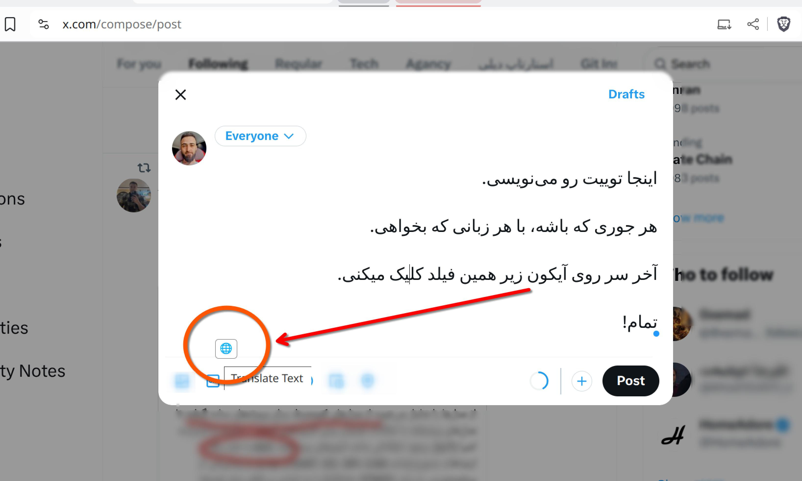
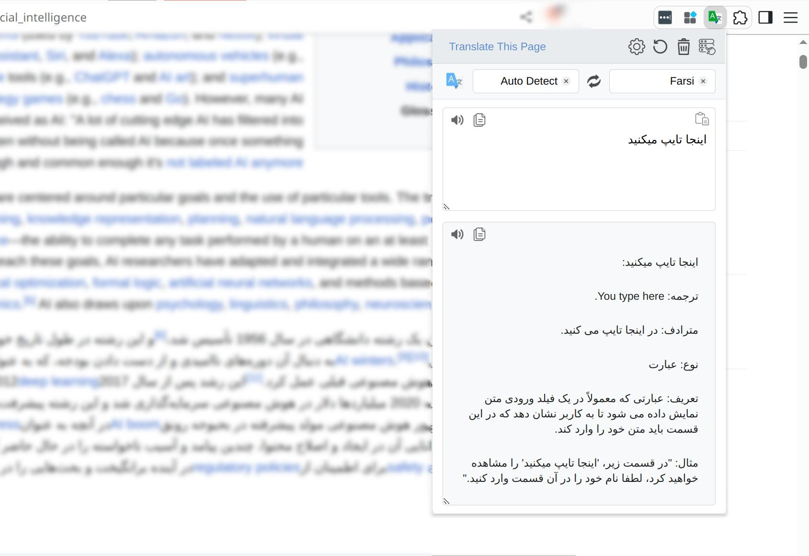
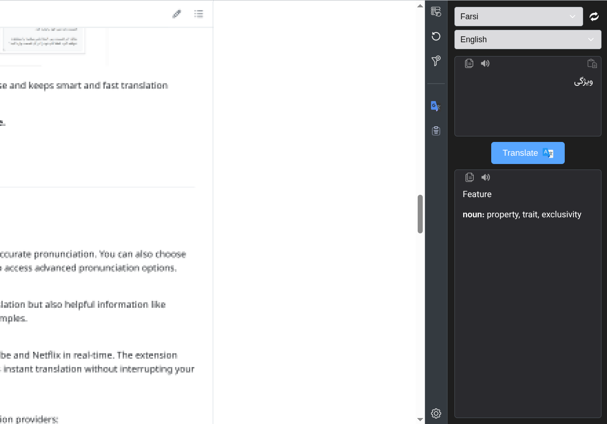
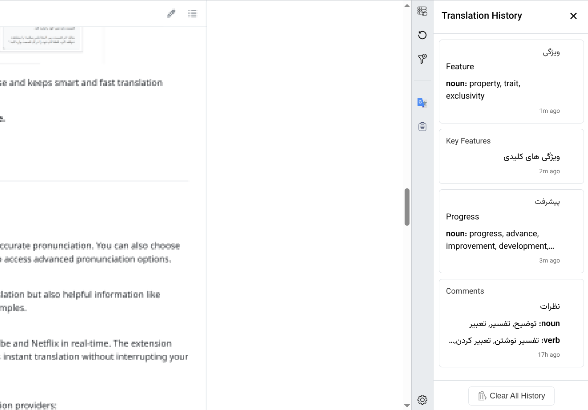

# Translate It!

> دستیار هوشمند ترجمه - افزونه مترجم

<p align="center">
  <a target="_blank" href="https://chromewebstore.google.com/detail/AI%20Writing%20Companion%20for%20Chrome/jfkpmcnebiamnbbkpmmldomjijiahmbd/">
    
  </a>
  <a target="_blank" href="https://addons.mozilla.org/en-GB/firefox/addon/ai-writing-companion/">
    
  </a>

</p>

<br>

---

<div dir="rtl" style="text-align: right;">

<br>

<div align="center">
    <strong>
        • <a href="./README.md">English</a> | 
        • <a href="./README_FARSI.md">فارسی</a>
    </strong>
</div>

<br>

<p align="center">
  
</p>

<br>

این افزونه یک ابزار سبک و کارآمد برای ترجمه متون در صفحاتِ وب و همچنین متونی است که می‌نویسید. با ارائه چند روش ترجمه و جستجوی لغت، تجربه‌ای سریع و بی‌دردسر را فراهم می‌کند.

- **ترجمه با انتخاب متن:** به‌سادگی بخشی از متن را انتخاب کنید تا پنجره‌ای برای نمایش ترجمه دقیقاً در همان محل ظاهر شود.  
  همچنین می‌توانید تنظیم کنید که به‌جای نمایش مستقیم ترجمه، یک آیکون کوچک زیر متن انتخاب‌شده نمایش داده شود که با کلیک روی آن، ترجمه نشان داده می‌شود.

  <p align="center">
    
    
  </p>

- **ترجمه با انتخاب قسمتی از صفحه:** با فعال‌سازی حالت "انتخاب اِلِمان" از طریق آیکون افزونه در نوار ابزار، می‌توانید هر بخش از صفحه (مانند پاراگراف یا دکمه) را بدون تغییر در چینش، به‌طور کامل ترجمه کنید.

<p align="center">
  
  
  
</p>

- **ترجمه در حین نوشتن:** وقتی در فیلدهای متنی یا فرم‌ها مشغول تایپ هستید، می‌توانید یا با فشار کلید میانبر `Ctrl + /` یا با کلیک روی آیکون مترجم کوچک کنار فیلد، متن خود را قبل از ارسال به سرعت ترجمه کنید.

<p align="center">
  
</p>

- **ترجمه پیشرفته از طریق Popup/Sidepanel:** با کلیک روی آیکون افزونه در نوار ابزار، یک پنجره popup فعال می‌شود که علاوه بر ترجمه، امکانات بیشتری مانند بررسی تلفظ و ارائه اطلاعات دیکشنری و تاریخچه را در اختیار قرار می‌دهد.

<p align="center">
  
  
  
</p>

این افزونه به صورت اختصاصی برای استفاده شخصی توسعه یافته و ترجمه‌ای هوشمند و سریع را همیشه در دسترس قرار می‌دهد.

**ترجمه هوشمند و سریع، همیشه و همه جا.**

<br>

<div dir="rtl" style="text-align: right;">

## ✨ ویژگی‌های کلیدی

💸 **رایگان:**
برای همیشه، کد منبع باز

🔊 **تلفظ لغات و جملات:**
همراه با هر ترجمه، امکان شنیدن تلفظ دقیق کلمات و جملات فراهم است. همچنین با انتخاب لهجه‌های مختلف، می‌توانید تلفظ مورد نظر خود را بشنوید. تنها کافیست روی آیکون مترجم در نوار ابزار کلیک کنید تا به بخش تلفظ پیشرفته دسترسی پیدا کنید.

📙 **حالت دیکشنری (Dictionary Mode):**
با انتخاب یک کلمه در صفحه، علاوه بر ترجمه، اطلاعات جامعی از قبیل معنی، مترادف‌ها، نوع کلمه و مثال‌های کاربردی نمایش داده می‌شود. این قابلیت به شما کمک می‌کند تا درک عمیق‌تری از لغات داشته باشید.

✅ **پشتیبانی از ارائه‌دهندگان ترجمه متنوع:**
این افزونه از چندین سرویس ترجمه هوش مصنوعی پشتیبانی می‌کند تا بهترین گزینه را مطابق نیازهای خود انتخاب کنید:

- [Google Translate][google-translate-url] (✔ رایگان)
- [DeepL Translate][deepl-url] (✔ رایگان)
- [Gemini][gemini-url] (✔ رایگان)
- [Yandex Translate][yandex-url] (✔ رایگان)
- [Microsoft Bing Translator][bing-url] (✔ رایگان)
- [Browser Translator][browserapi-url] (✔ رایگان)
- [WebAI to API][webai-to-api-url] (✔ رایگان)
- [OpenAI][openai-url]
- [OpenRouter][openrouter-url]
- [DeepSeek][deepseek-url]
- Custom OpenAI Compatible (به [تنظیمات پیش‌رفته](#advanced-settings) رجوع کنید)

</div>

<br>

## 📋 نیازمندی‌ها

- مرورگر مدرن مبتنی بر Chromium یا Firefox (Chrome، Edge، Brave و غیره)
- یک کلید API معتبر (در صورت عدم استفاده از [Google Translate][google-translate-url] یا [WebAI to API][webai-to-api-url])

<br>

---

## 🔧 دانلود و نصب

<p align="center">
  <a target="_blank" href="https://chromewebstore.google.com/detail/AI%20Writing%20Companion%20for%20Chrome/jfkpmcnebiamnbbkpmmldomjijiahmbd/">
    
  </a>
  <a target="_blank" href="https://addons.mozilla.org/en-GB/firefox/addon/ai-writing-companion/">
    
  </a>
</p>

<details id="manual-install">
<summary>
نصب دستی
</summary>

<details id="install-for-chrome">
<summary>
  <h3>نصب دستی افزونه مترجم کروم</h3>
</summary>

- [از اینجا آخرین نسخه مخصوص کروم را دانلود کنید][chrome-zip-url]
- فایل ZIP دانلود شده را از حالت فشرده خارج کنید.
- آدرس [`chrome://extensions`][chrome-extensions-url] را در کروم باز کنید و **Developer mode** را فعال کنید.
- فولدر استخراج شده را به صفحه `chrome://extensions` بکشید و رها کنید تا افزونه نصب شود.
- تمام

_توجه_: بعد از نصب، با کلیک روی **آیکون افزونه** در مرورگر، به **تنظیمات** بروید و کلید **API خود** را وارد کنید.

</details>
<br>

<details id="install-for-firefox">
<summary>
  <h3>نصب دستی افزونه مترجم فایرفاکس</h3>
</summary>

- [از اینجا آخرین نسخه مخصوص فایرفاکس را دانلود کنید][firefox-zip-url]
- فایل ZIP دانلود شده را از حالت فشرده خارج کنید.
- آدرس [`about:debugging#/runtime/this-firefox`][firefox-extensions-url] را در فایرفاکس بازکنید
- با انتخاب دکمه `Load Temporary Add-on...` آدرس مسیر `manifest.json` برای فایرفاکس در فولدر استخراج شده را بدهید.
- تمام!

_توجه_: بعد از نصب، با کلیک روی **آیکون افزونه** در مرورگر، به **تنظیمات** بروید و کلید **API خود** را وارد کنید.

</details>

</details>

<br>

---

## 🔑 کلیدهای API

برای استفاده از ترجمه با هوش مصنوعی، باید از یکی از سرویس‌های زیر یک API Key بگیرید:

| ارائه‌دهنده      | دریافت کلید API                                  | هزینه  |
| ---------------- | ------------------------------------------------ | ------ |
| Google Translate | _نیازی نیست_                                     | رایگان |
| Yandex Translate | _نیازی نیست_                                     | رایگان |
| Bing Translate   | _نیازی نیست_                                     | رایگان |
| DeepL            | [کلیدهای API DeepL][deepl-api-key-url]           | رایگان |
| Google Gemini    | [Google AI Studio][gemini-api-key-url]           | رایگان |
| WebAI to API     | _[سرور محلی][webai-to-api-url]_                  | رایگان |
| OpenRouter       | [کلیدهای API OpenRouter][openrouter-api-key-url] | رایگان |
| OpenAI           | [کلیدهای API OpenAI][openai-api-key-url]         | پولی   |
| DeepSeek         | [کلیدهای API DeepSeek][deepseek-api-key-url]     | پولی   |
| Custom OpenAI    | -                                                | -      |

**توجه:** **`WebAI to API`** یک سرور python است که بدون نیاز به API میتونید API Local داشته باشید.

**توجه:** برای بچه‌های داخل ایران، احتمالا برای دریافت `API Key` رایگان مجبور باشید VPN استفاده کنید.

<br>

---

<details>
<summary>
  <h2>🪶 نحوه استفاده</h2>
</summary>

1. **افزودن افزونه به مرورگر**

   پس از نصب، افزونه را به نوار ابزار مرورگر پین کنید تا همیشه در دسترس باشد.

2. **فعال‌سازی «حالت انتخاب المنت»**

   برای ترجمه بخشی از یک صفحه وب، ابتدا باید `حالت انتخاب المنت` را فعال کنید. این کار از طریق یکی از روش‌های زیر ممکن است:

   - کلیک روی آیکون افزونه و انتخاب گزینه‌ی مربوطه
   - کلیک راست روی صفحه و انتخاب گزینه از منوی زمینه (Context Menu)
   - یا [استفاده از کلید میان‌بر](#keyboard-shortcuts) برای فعال‌سازی سریع‌تر

3. **ترجمه متن با کلیک روی المنت**

   پس از فعال‌سازی، نشان‌گر ماوس را روی هر بخشی از صفحه ببرید تا هایلایت شود. سپس با کلیک روی آن بخش، متن آن قسمت بلافاصله ترجمه خواهد شد.

4. **بازگرداندن ترجمه به حالت اولیه**

   برای لغو ترجمه و بازگرداندن متن به حالت اصلی، از یکی از روش‌های زیر استفاده کنید:

   - فشردن کلید `ESC`
   - کلیک روی دکمه‌ی `Revert` از پنجره افزونه

5. **کش ترجمه**

   اگر متنی را ترجمه کرده و سپس بازگردانده باشید، ترجمه‌های بعدی همان بخش از حافظه کش افزونه انجام می‌شوند.
   در این حالت، پیام موقتی «از حافظه» در گوشه بالا-راست صفحه نمایش داده می‌شود.

6. **پاک‌سازی حافظه کش**

   با کلیک روی پیام «از حافظه»، حافظه کش آن بخش پاک می‌شود و ترجمه بعدی مستقیماً از سرور دریافت خواهد شد.

---

### <div id="keyboard-shortcuts">کلیدهای میان‌بر</div>

برای فعال‌سازی سریع حالت انتخاب المنت، می‌توانید از کلیدهای میان‌بر استفاده کنید.  
پیشنهاد می‌شود برای جلوگیری از تداخل با سایر کلیدهای مرورگر یا برنامه‌ها، این میان‌برها را به صورت دستی تنظیم نمایید.

#### تنظیم میان‌برها:

- **در Chrome**:  
  به این مسیر بروید: [`chrome://extensions/shortcuts`](chrome://extensions/shortcuts)

- **در Firefox**:

  1. روی آیکون افزونه در نوار ابزار راست‌کلیک کرده و گزینه `Manage Extension` را انتخاب کنید.
  2. در پنجره بازشده، روی آیکون چرخ‌دنده کلیک نمایید.
  3. گزینه `Manage Extension Shortcuts` را انتخاب کنید.

</details>

<br>

---

<details id="known-issues">
  <summary>
    <h3>⚠️ مشکلات شناخته شده</h3>
  </summary>

این بخش محدودیت‌ها و مشکلات شناخته‌شده‌ای را که کاربران ممکن است هنگام استفاده از افزونه با آن مواجه شوند، مستند می‌کند.

### مشکلات مترجم Bing در حالت انتخاب المنت

هنگام استفاده از **مترجم Bing** با قابلیت **Select Element** در صفحات پیچیده یا طولانی، متن ترجمه شده ممکن است موقعیت صحیح خود را حفظ نکند و در مکان‌های نادرست ظاهر شود. این یک محدودیت شناخته‌شده سرویس Bing است که با معماری فعلی افزونه همخوانی ندارد.

**راه حل:** برای بهترین نتایج در حالت Select Element، از سایر پرووایدرها مانند Google Translate، Gemini یا DeepL استفاده کنید که ساختارهای پیچیده صفحه را بهتر مدیریت می‌کنند.

---

### کیفیت ترجمه در حالت انتخاب المنت در صفحات پیچیده

برای به حداکثر رساندن کارایی و به حداقل رساندن استفاده از Token و درخواست‌های API از سمت پرووایدرهای ترجمه، افزونه قبل از ارسال متن برای ترجمه، به شدت آن را بهینه می‌کند. این استراتژی بهینه‌سازی، اگرچه برای کارایی و هزینه لازم است، می‌تواند منجر به کاهش کیفیت ترجمه هنگام استفاده از **حالت Select Element** در صفحات وب پیچیده شود.

**جزئیات فنی:** افزونه متن‌ها را گروه‌بندی و تکه‌تکه می‌کند تا تعداد درخواست‌های API را به حداقل برساند. در صفحات با چیدمان‌های پیچیده یا انواع محتوای ترکیبی، این بهینه‌سازی ممکن است اطلاعات سیاقی را به شکلی تقسیم کند که بر دقت ترجمه تاثیر بگذارد.

**مصالحه طراحی:** این یک تصمیم آگاهانه برای ایجاد تعادل بین موارد زیر است:
- ✅ کاهش هزینه‌های API (Token کمتر استفاده می‌شود)
- ✅ سرعت ترجمه بالاتر
- ✅ مصرف کمتر منابع
- ❌ کاهش احتمالی کیفیت ترجمه در سناریوهای پیچیده

**توصیه:** برای محتوای حساس که کیفیت ترجمه در آن در اولویت است، به جای حالت Select Element از ترجمه `Popup/Sidepanel` یا `Select Text` استفاده کنید، زیرا حفظ سیاق بهتری دارند.

</details>

<br>

---

<details id="advanced-settings">
  <summary>
    <h3>⚙️ تنظیمات پیشرفته</h3>
  </summary>

در بخش تنظیمات API افزونه، برای هر ارائه‌دهنده خدمات ترجمه، تنظیمات اختصاصی وجود دارد که به شما امکان می‌دهد مدل‌های مختلف را بر اساس نیاز خود انتخاب و تنظیم کنید:

- **Google Gemini**

  در این قسمت می‌توانید آدرس `API URL` را تغییر دهید تا از مدل‌های دیگر Gemini استفاده کنید. مدل‌ها و تنظیمات مختلف در [مستندات رسمی Gemini][gemini-url-docs] توضیح داده شده‌اند. انتخاب مدل مناسب می‌تواند بر کیفیت، سرعت و هزینه ترجمه تأثیرگذار باشد.

- **OpenAI**

  در تنظیمات OpenAI، می‌توانید با وارد کردن نام مدل (مثل `gpt-4` یا `gpt-3.5-turbo`) از مدل دلخواه استفاده کنید. برای مشاهده لیست کامل مدل‌ها و اطلاعات بیشتر، به [مستندات OpenAI][openai-url-docs] مراجعه کنید. تغییر مدل می‌تواند تجربه ترجمه را از نظر دقت یا هزینه شخصی‌سازی کند.

- **OpenRouter**

  مانند OpenAI، در بخش OpenRouter نیز می‌توانید با مراجعه به [مستندات OpenRouter][openrouter-url-docs]، مدل مورد نظر خود را انتخاب کرده و نام آن را در تنظیمات وارد کنید. OpenRouter از چندین مدل مختلف پشتیبانی می‌کند و امکان انعطاف‌پذیری بیشتری به شما می‌دهد.

- **DeepSeek**

  در DeepSeek نیز می‌توانید با مراجعه به [مستندات DeepSeek][deepseek-url-docs]، مدل را در تنظیمات وارد کنید.

- **DeepL**

  DeepL هر دو نسخه رایگان (Free) و حرفه‌ای (Pro) را ارائه می‌دهد. می‌توانید نسخه API را در تنظیمات انتخاب کنید. نسخه رایگان محدودیت استفاده دارد، در حالی که نسخه Pro محدودیت‌های بیشتری و ویژگی‌های اضافی ارائه می‌دهد. DeepL همچنین از تنظیمات رسمی (پیش‌فرض، رسمی‌تر، کمتر رسمی) برای برخی زبان‌ها پشتیبانی می‌کند. برای اطلاعات بیشتر به [مستندات DeepL][deepl-url-docs] مراجعه کنید.

- **WebAI to API**

  این نرم‌افزار، یک API محلی (local) و رایگان است که نیازی به کلید ندارد. می‌توانید مدل‌های دلخواه خود را در تنظیمات آن تعریف کنید. برای آشنایی با نحوه پیکربندی و مدل‌های قابل استفاده، به [مستندات WebAI to API][webai-to-api-url-docs] مراجعه نمایید.

- **سفارشی (سازگار با OpenAI)**

  این گزینه برای ایجاد حداکثر انعطاف‌پذیری طراحی شده و به شما امکان می‌دهد تا به هر سرویس API که با ساختار `chat completions` در OpenAI سازگار است، متصل شوید. کافیست مقادیر سفارشی `API URL`، `API Key` و `Model Name` را در تنظیمات وارد کنید. این قابلیت برای استفاده از مدل‌های شخصی (self-hosted)، مدل‌های زبان بزرگ محلی (مانند استفاده از Ollama) یا سایر ارائه‌دهندگان شخص ثالث که با این ساختار سازگار هستند، ایده‌آل است. برای اطلاع از ساختار مورد نیاز، به [مستندات API در OpenAI][openai-url-docs] مراجعه کنید.

<br>

> تنظیم مدل‌ها این امکان را می‌دهد تا بین هزینه، کیفیت، و سرعت ترجمه، تعادل مناسب را انتخاب کنید.
> ساختار و پرامت‌های نوشته شده با تنظیمات حداقلی هر کدام از ارایه دهندگان انجام شده.
> یعنی اگر مدل‌های بهتر را انتخاب کنید، کیفیت ترجمه هم تاثیر گذار خواهد بود. بصورت پیش‌فرض
> نیازی به تنظیمات اضافی نیست، کیفیت ترجمه خوب و قابل قبولی را ارایه میدهد.

<br>

_نکته:_ برای `OpenAI` و `OpenRouter` بصورت پیش‌فرض از `gpt-3.5-turbo` استفاده می‌شود.

_نکته:_ برای `Google Gemini` و `WebAI to API` بصورت پیش‌فرض از `gemini-2.5-flash` استفاده می شود.

_نکته:_ برای `DeepSeek` مدل پیش‌فرض `deepseek-chat` است.

<br>

</details>

<br>

---

<details>
<summary>
  <h3>☕ مهمونم کنید</h3>
</summary>

اگر این پروژه براتون مفید بود، یه قهوه مهمونم کنید : )

<br>

| روش‌های دونیت       | 🔗 لینک                                                                                                                                                                                                                 |
| ------------------- | ----------------------------------------------------------------------------------------------------------------------------------------------------------------------------------------------------------------------- |
| **BuyMeACoffee**    | <a href="https://www.buymeacoffee.com/m_khani" target="_blank"></a> |
| **USDT (Ethereum)** | `0x76DAF7D7C3f7af9B90e16B5C25d063ff3A1A0f8f`                                                                                                                                                                            |
| **Bitcoin (BTC)**   | `bc1qgxj96s6nks6nyhzlncw65nnuf7pyngyyxmfrsw`                                                                                                                                                                            |
| **PayPal**          | [](https://www.paypal.com/donate/?hosted_button_id=DUZBXEKUJGKLE)                                                      |

</details>

<br>

با تشکر از حمایت شما!

<br>

---

### 👥 مشارکت‌کنندگان

<br>

- iSegar0 [-iSegar0-blue?style=flat&logo=x>)](https://x.com/iSegar0/)
- Mohammad [-M_Khani65-blue?style=flat&logo=x>)](https://x.com/M_Khani65/)

<br>

---

<details>
<summary>
  <h3>🥤 توسعه</h3>
</summary>

### پیش‌نیازها

مطمئن شوید [**Node.js**][node-js-url] و [**pnpm**][pnpm-url] نصب شده باشند. سپس، ریپازیتوری را کلون کرده و وابستگی‌ها را نصب کنید:

<div dir="ltr" style="text-align: left;">

```bash
git clone https://github.com/iSegar0/Translate-It.git
cd Translate-It
pnpm install
```

</div>

### راه‌اندازی اولیه

پس از نصب وابستگی‌ها، دستور راه‌اندازی را اجرا کنید تا همه ابزارهای توسعه پیکربندی شوند:

<div dir="ltr" style="text-align: left;">

```bash
pnpm run setup
```

</div>

این دستور محیط توسعه را پیکربندی کرده و ابزارهای اضافی مورد نیاز برای اعتبارسنجی را نصب می‌کند.

### ساخت برای توسعه

برای تولید فایل‌های باز (unpacked) افزونه جهت توسعه، دستورات زیر را اجرا کنید:

<div dir="ltr" style="text-align: left;">

```bash
# ساخت برای هر دو مرورگر
pnpm run build

# ساخت برای یک مرورگر خاص
pnpm run build:chrome
pnpm run build:firefox
```

</div>

این دستورات فایل‌های لازم را در مسیرهای `dist/chrome/` و `dist/firefox/` ایجاد می‌کنند که می‌توانید به عنوان افزونه موقت در مرورگر خود بارگذاری کنید.

برای توسعه فعال و اعمال تغییرات در لحظه، از یکی از دستورات زیر استفاده کنید:

<div dir="ltr" style="text-align: left;">

```bash
pnpm run watch:chrome
pnpm run watch:firefox
```

</div>

### کیفیت کد و اعتبارسنجی

#### بررسی کد با Lint

برای اطمینان از کیفیت کد و شناسایی سریع مشکلات احتمالی، می‌توانید دستور زیر را اجرا کنید:

<div dir="ltr" style="text-align: left;">

```bash
# بررسی کد برای هر دو مرورگر
pnpm run lint

# بررسی کد برای مرورگر خاص
pnpm run lint:source:chrome
pnpm run lint:source:firefox
```

</div>

این دستور تمام فایل‌های `src/**/*.js` را بررسی می‌کند و خطاهای نحوی یا الگوهای ناایمن را گزارش می‌دهد.

#### اعتبارسنجی افزونه

اعتبارسنجی افزونه‌های ساخته شده برای اطمینان از رعایت الزامات فروشگاه مرورگرها:

<div dir="ltr" style="text-align: left;">

```bash
# اعتبارسنجی هر دو مرورگر
pnpm run validate

# اعتبارسنجی مرورگرهای خاص
pnpm run validate:firefox
pnpm run validate:chrome
```

</div>

**توجه:** برای اعتبارسنجی کروم، نیاز به نصب web-ext دارید. اگر در دسترس نیست، با دستور زیر نصب کنید:

<div dir="ltr" style="text-align: left;">

```bash
pnpm run setup:chrome-validator
```

</div>

#### فرآیند پیش از ارسال

قبل از ارسال تغییرات، بررسی جامع پیش از ارسال را اجرا کنید:

<div dir="ltr" style="text-align: left;">

```bash
pnpm run pre-submit
```

</div>

این دستور lint، ساخت افزونه و اعتبارسنجی هر دو نسخه مرورگر را انجام می‌دهد.

### بسته‌بندی برای انتشار

زمانی که آماده ساخت پکیج‌های قابل توزیع هستید، از دستورات زیر استفاده کنید.

**برای بسته‌بندی سورس کد:**

این دستور یک آرشیو `.zip` از فایل‌های سورس پروژه با نام `Source-vX.X.X.zip` ایجاد می‌کند.

<div dir="ltr" style="text-align: left;">

```bash
pnpm run source
```

</div>

**برای ایجاد یک نسخه کامل:**

این دستور همه چیز را بسته‌بندی می‌کند: هم آرشیو سورس کد و هم پکیج‌های نهایی و قابل نصب `.zip` برای هر دو مرورگر.

<div dir="ltr" style="text-align: left;">

```bash
pnpm run publish
```

</div>

پس از اجرا، پوشه `dist/Publish/` حاوی فایل‌های زیر خواهد بود:

- `Source-vX.X.X.zip`
- `Translate-It-vX.X.X-for-Chrome.zip`
- `Translate-It-vX.X.X-for-Firefox.zip`

</details>

<br>

---

## 🤝 همکاری

- ⭐ **به این پروژه ستاره بدید** تا از پروژه پشتیبانی کنید.
- 🐞 **مشکلات را گزارش دهید:** [مشکلات GitHub][github-issues-url]
- 📝 **ارسال Pull Request (PR):** تا در بهبود پروژه مشارکت کنید.

---

<details>
<summary>
  <h3>🖼️ حقوق آثار</h3>

آیکون‌های استفاده‌شده در این پروژه از وب‌سایت [Flaticon](https://www.flaticon.com) هستند و توسط طراحان زیر ایجاد شده‌اند:

</summary>

-  — [Pixel perfect](https://www.flaticon.com/authors/pixel-perfect) (آیکون اصلی)
-  — [Pixel perfect](https://www.flaticon.com/authors/pixel-perfect) (انتخاب)
-  — [Pixel perfect](https://www.flaticon.com/authors/pixel-perfect) (چسباندن)
-  — [Tanah Basah](https://www.flaticon.com/free-icons/voice-command) (فرمان صوتی)
-  — [photo3idea_studio](https://www.flaticon.com/free-icons/translate) (ترجمه)
-  — [Midev](https://www.flaticon.com/free-icons/clear) (پاک کردن)
-  — [Miftakhul Rizky](https://www.flaticon.com/free-icons/close) (بستن)
-  — [Freepik](https://www.flaticon.com/authors/freepik) (تغییر جای)
-  — [Freepik](https://www.flaticon.com/authors/freepik) (تنظیمات)
-  — [Catalin Fertu](https://www.flaticon.com/free-icons/copy) (کپی)
-  — [KP Arts](https://www.flaticon.com/free-icons/revert) (بازگشت)
-  — [KP Arts](https://www.flaticon.com/free-icons/app) (پنل کناری)

</details>

<br>

---

### تاریخچه محبوبیت

<a href="https://www.star-history.com/#iSegaro/Translate-It&Date">
 <picture>
   <source media="(prefers-color-scheme: dark)" srcset="https://api.star-history.com/svg?repos=iSegaro/Translate-It&type=Date&theme=dark" />
   <source media="(prefers-color-scheme: light)" srcset="https://api.star-history.com/svg?repos=iSegaro/Translate-It&type=Date" />
   
 </picture>
</a>

<br>

---

### 📜 مجوز

این پروژه تحت **مجوز MIT** است. آزادانه بهبود دهید و به اشتراک بگذارید!

سال ۱۴۰۴ - ۲۰۲۵

[google-translate-url]: https://translate.google.com/
[gemini-url]: https://gemini.com/
[deepl-url]: https://www.deepl.com/
[openai-url]: https://chat.openai.com/
[deepseek-url]: https://chat.deepseek.com/
[openrouter-url]: https://openrouter.ai/
[webai-to-api-url]: https://github.com/Amm1rr/WebAI-to-API/
[browserapi-url]: https://developer.chrome.com/docs/ai/translator-api/
[bing-url]: https://www.bing.com/translator/
[yandex-url]: https://translate.yandex.com/en/
[firefox-store]: https://addons.mozilla.org/en-GB/firefox/addon/ai-writing-companion/
[chrome-store]: https://chromewebstore.google.com/detail/AI%20Writing%20Companion%20for%20Chrome/jfkpmcnebiamnbbkpmmldomjijiahmbd/
[firefox-zip-url]: https://github.com/iSegaro/Translate-It/tree/main/dist/Publish/
[chrome-zip-url]: https://github.com/iSegaro/Translate-It/tree/main/dist/Publish/
[chrome-extensions-url]: chrome://extensions/
[firefox-extensions-url]: about:debugging#/runtime/this-firefox/
[gemini-api-key-url]: https://aistudio.google.com/apikey/
[deepl-api-key-url]: https://www.deepl.com/en/your-account/keys/
[openai-api-key-url]: https://platform.openai.com/api-keys/
[deepseek-api-key-url]: https://platform.deepseek.com/api-keys/
[openrouter-api-key-url]: https://openrouter.ai/settings/keys/
[mohammad-x-url]: https://x.com/m_khani65/
[github-issues-url]: https://github.com/iSegaro/AIWritingCompanion/issues/
[isegaro-x-url]: https://x.com/iSegar0/
[m-khani65-x-url]: https://x.com/M_Khani65/
[flaticon-url]: https://www.flaticon.com/free-icons/translate/
[gemini-url-docs]: https://ai.google.dev/api/all-methods/
[deepl-url-docs]: https://www.deepl.com/docs-api/
[openai-url-docs]: https://platform.openai.com/docs/models/
[deepseek-url-docs]: https://api-docs.deepseek.com/api/list-models/
[openrouter-url-docs]: https://openrouter.ai/models/
[webai-to-api-url-docs]: https://github.com/Amm1rr/WebAI-to-API/
[pnpm-url]: https://pnpm.io/
[node-js-url]: https://nodejs.org/

</div>
