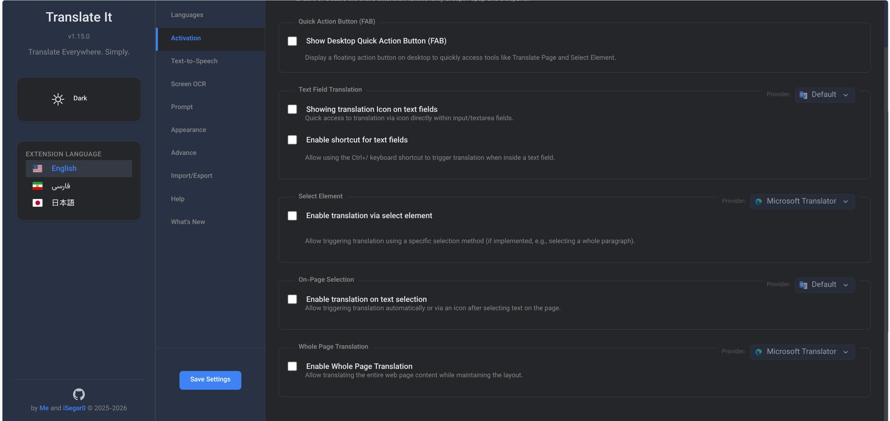
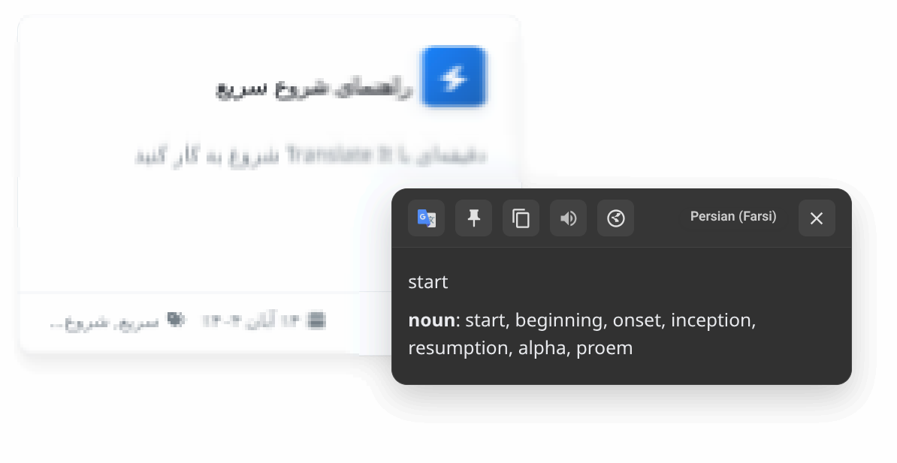

# Translate It!
> モダンブラウザ向けの究極の翻訳エコシステム。

  
  

 

---

 

  <strong>
    • <a href="../README.md">English</a> | 
    • <a href="./README_FARSI.md">فارسی</a> | 
    • 日本語
  </strong>

 

  

**Translate It** は単なる翻訳ツールではありません。あらゆるデバイスで言語の壁を越えるために設計された、高性能でモジュール式のエコシステムです。「ゼロプレッシャー」の哲学に基づいて設計されており、数十のタブが開いている状態でも、システムリソースに負荷をかけたり RAM を膨張させたりすることなく、モダンブラウザでシームレスに動作するように最適化されています。**Vue.js 3** で構築され、**10 以上のプロバイダー**に対応。プライバシー、スピード、そしてコスト効率に重点を置いた、ウェブ翻訳への緻密なアプローチを提供します。

 

  <a href="https://www.youtube.com/watch?v=oMw-CbcKPOY">
    <b>YouTube でデモを見る</b>
  </a>
   
  

---

## なぜ Translate It なのか？

- **プライバシー第一:** OCR やコアプロセスはローカルで実行されます。データがブラウザの外に出ることはありません。
- **AI 搭載:** Gemini、OpenAI、DeepSeek などに対応。
- **コスト効率:** 独自の「エコノミーモード」により、**AI トークンを最大 70% 節約**。
- **ゼロプレッシャー・エンジニアリング:** 低フットプリント動作に最適化。RAM の膨張やシステムの速度低下を心配することなく、数十のタブを開いたままにできます。
- **プラットフォームを選ばない:** デスクトップ版 Chrome から Android 版 Firefox まで、シームレスな体験を提供。

---

## 主な機能

### 1. 高度な翻訳エンジン
- **プログレッシブ・ストリーミング・エンジン:** 長い翻訳を待つ必要はありません！システムが長いテキストを最適化されたセグメントに分割し、準備ができたものからリアルタイムで表示します。すべてのプロバイダーでスムーズかつレスポンシブな体験を提供します。
- **10 以上のプロバイダー:** 高度な AI モデル（LLM）と従来のプロバイダー（Google、Microsoft、DeepL）を瞬時に切り替え可能。

 

### 2. 精密な要素翻訳（ポイント＆クリック）
- **視覚的ハイライト:** モードを有効にして、段落、ボタン、またはメニューにマウスを合わせると、リアルタイムでオレンジ色のハイライトが表示されます。クリックするだけで、その特定の要素を瞬時に翻訳します。
- **レイアウトの維持:** ウェブサイトの構造内で直接テキストを翻訳します。ページのレイアウトは 100% 維持されます。
- **ホバープレビュー:** 原文を確認したいですか？翻訳された要素にマウスを合わせるだけで、精密なツールチップで原文を表示します。
<!-- ELEMENT_SELECTION_SCREENSHOT_PLACEHOLDER -->

 

### 3. スマートなページ全体翻訳（遅延読み込み）
- **無限スクロール対応:** スクロールするたびに新しいコンテンツを自動的に検出し、翻訳します。SNS や長文記事に最適です。
- **2 つの実行モード:** 
  - **流動モード (Fluid):** コンテンツがビューポートに入ると同時にリアルタイムで翻訳します。
  - **停止時モード (On-Stop):** スクロールが終わるまで待機してから翻訳を開始し、API コストを節約し視覚的なノイズを軽減します。
<!-- WHOLE_PAGE_SCREENSHOT_PLACEHOLDER -->

 

### 4. スクリーンキャプチャ & OCR（あらゆるものをテキストへ）
- **ビジュアル翻訳:** 画像、動画、PDF、または選択不可能なウェブ領域からテキストをキャプチャして翻訳。
- **オフラインエンジン:** Tesseract.js を搭載。ローカルモデルのキャッシュにより、「完全オフライン」のプライバシーを実現。
<!-- OCR_SCREENSHOT_PLACEHOLDER -->

 

### 5. スマート最適化スライダー（経済性 vs ターボ）
API コストと UI スピードを **最適化レベル（1〜5）** で完全にコントロール：
- **エコノミーモード（レベル 1）:** 1 回のリクエストで 70% 多くのテキストを処理。AI トークンの節約や、従来のプロバイダーでの IP バン防止に最適。
- **ターボモード（レベル 5）:** 並列処理を最大化し、最速の UI レスポンスを実現。
<!-- OPTIMIZATION_SLIDER_PLACEHOLDER -->

 

### 6. クロスプラットフォーム・エルゴノミクス
- **モバイル・ボトムシート:** Android 版 Firefox、Kiwi、Lemur などのモバイルブラウザ向けに、ジェスチャー操作に対応した親指で操作しやすいネイティブライクなインターフェース。
- **デスクトップ/モバイル FAB メニュー:** OCR、ページ翻訳、要素モード、および迅速な機能切り替え（インスタント TTS や直接翻訳モードなど）のための多目的ハブ。

---

## 機能一覧

| 機能 | 説明 |
| :--- | :--- |
| **テキスト選択** | テキストを選択した場所に翻訳アイコンやボックスを即座に表示。 |
| **要素モード** | UI 要素をクリックして、レイアウトを維持したままインラインで翻訳。 |
| **ページ全体翻訳** | 遅延読み込みとスマートなメモリ管理により、ページ全体を自動翻訳。 |
| **デスクトップ/モバイル FAB** | OCR、要素モード、即時設定にアクセスできる多目的フローティングハブ。 |
| **入力欄翻訳 (Ctrl+/)** | 送信前にテキスト入力欄の内容をその場で翻訳。 |
| **スマート辞書** | 定義、類義語、使用例をマルチアクセントの音声合成とともに表示。 |
| **履歴とエクスポート** | 翻訳履歴を管理し、後で利用するためにエクスポート可能。 |
| **リソーストッカー** | ブラウザを高速に保つための高度なメモリ管理システム。 |

---

## はじめに

### 1. インストール
最適な体験のために、公式ストアからインストールしてください：

  
  

*手動でのインストールについては、[インストールガイド](./guides/INSTALLATION.md)をご覧ください。*

### 2. 設定
ほとんどの AI プロバイダーには API キーが必要です。
- [**API 設定ガイド**](./guides/API_GUIDE.md)に従って、Gemini や OpenAI などを設定してください。
- *Google や Yandex などの無料プロバイダーは、設定なしですぐに使用できます。*

### 3. ショートカットの活用
[**ユーザーガイド**](./guides/USAGE.md)でショートカットを確認し、生産性を最大限に高めましょう。

---

## 開発と貢献

Vue 3、Pinia、Vite を使用した **フィーチャーベース・アーキテクチャ** を採用しています。
- **アーキテクチャ:** モジュール化されたシステムの詳細は [ARCHITECTURE.md](./technical/ARCHITECTURE.md) をご覧ください。
- **貢献:** ローカルセットアップの手順については [CONTRIBUTING.md](./guides/CONTRIBUTING.md) をお読みください。
- **ローカライゼーション:** [ローカライゼーションガイド](./guides/LOCALIZATION_GUIDE.md)に従って、翻訳の追加や更新にご協力ください。

---

## 貢献者
- [**Mohammad**](https://x.com/M_Khani65/)
- [**iSegar0**](https://x.com/iSegar0/)

---

## ライセンス
**MIT ライセンス**の下で公開されています。

---

  

