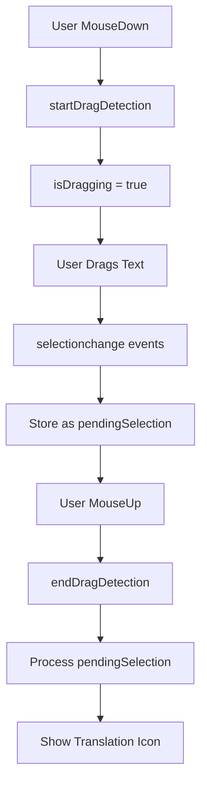

# Text Selection System

## نگاه کلی

سیستم Text Selection یکی از بخش‌های کلیدی افزونه Translate-It است که مسئول تشخیص، مدیریت و پردازش انتخاب متن در صفحات وب می‌باشد. این سیستم با **معماری مدرن ماژولار (2025)** و بر اساس drag detection، تجربه کاربری بهینه‌ای را برای ترجمه متن‌های انتخابی فراهم می‌کند.

### ✅ آپدیت‌های 2025:
- **معماری ماژولار**: سیستم SiteHandlerRegistry برای مدیریت site-specific handlers
- **Static Import Resolution**: حل مشکل dynamic import در bundle با استفاده از static imports
- **Site Handler Classes**: ZohoWriterHandler، GoogleSuiteHandler، MicrosoftOfficeHandler و سایر handlers
- **Field Detection Improvements**: سیستم بهبود یافته تشخیص نوع فیلد با async/await صحیح
- **Professional Editor Support**: پشتیبانی کامل از Google Docs، Zoho Writer، WPS Office، Notion

## معماری

### 🎯 کامپوننت‌های اصلی

#### 1. **TextSelectionHandler** 
`src/features/text-selection/handlers/TextSelectionHandler.js`

- مدیریت event listeners برای selection events
- تشخیص نوع فیلد (professional editor vs regular content)
- پیاده‌سازی drag detection اصولی
- ارتباط با TextSelectionManager

#### 2. **TextSelectionManager**
`src/core/managers/content/TextSelectionManager.js`

- پردازش و مدیریت انتخاب متن
- تعامل با WindowsManager برای نمایش UI
- مدیریت state انتخاب و drag detection
- پشتیبانی از iframe و cross-frame communication

#### 3. **SiteHandlerRegistry** (جدید)
`src/utils/text/registry/SiteHandlerRegistry.js`

- مدیریت مرکزی site-specific handlers
- Static import برای همه handlers (حل مشکل dynamic import)
- Caching و lifecycle management
- Pattern matching برای hostname ها

#### 4. **Site Handlers** (جدید)
- **ZohoWriterHandler**: `src/utils/text/sites/ZohoWriterHandler.js`
- **GoogleSuiteHandler**: `src/utils/text/sites/base/GoogleSuiteHandler.js`
- **MicrosoftOfficeHandler**: `src/utils/text/sites/base/MicrosoftOfficeHandler.js`
- **WPSHandler**: `src/utils/text/sites/WPSHandler.js`
- **NotionHandler**: `src/utils/text/sites/NotionHandler.js`
- **DefaultSiteHandler**: برای سایت‌های ناشناخته

#### 5. **FieldDetector** (بهبود یافته)
`src/utils/text/core/FieldDetector.js`

- تشخیص نوع فیلد با استفاده از site handlers
- تعیین selection strategy مناسب
- Async/await صحیح برای همه operations
- Cache management برای بهبود performance

## استراتژی‌های Selection

### 🎭 Selection Event Strategy

سیستم بر اساس نوع محتوا، استراتژی مناسب را انتخاب می‌کند:

#### 1. **Selection-Based Strategy** (محتوای معمولی)
```javascript
// برای وب‌سایت‌های معمولی
selectionEventStrategy: 'selection-based'
```
- استفاده از `selectionchange` events
- پردازش فقط پس از تکمیل drag
- مناسب برای محتوای استاتیک صفحات

#### 2. **Mouse-Based Strategy** (ویرایشگرهای حرفه‌ای)
```javascript
// برای Google Docs، Microsoft Office، WPS
selectionEventStrategy: 'mouse-based'
```
- استفاده از `mouseup` events
- تشخیص double-click برای professional editors
- مناسب برای محیط‌های پیچیده و iframe

### 🎯 Selection Strategy

#### 1. **Any Selection** (انتخاب معمولی)
```javascript
selectionStrategy: 'any-selection'
```
- هر انتخاب متنی پردازش می‌شود
- برای محتوای معمولی صفحات

#### 2. **Double-Click Required** (ویرایشگرهای حرفه‌ای)
```javascript
selectionStrategy: 'double-click-required'
```
- نیاز به double-click برای فعال‌سازی
- برای Google Docs، WPS، Microsoft Office

## Drag Detection (رویکرد اصولی)

### 🚀 مزایای رویکرد جدید

#### ❌ روش قدیمی (Timeout-Based)
```javascript
// مشکل‌دار و غیراصولی
selectionchange → setTimeout(500ms) → maybe show icon
```

#### ✅ روش جدید (Drag Detection)
```javascript
// اصولی و مطمئن
mousedown → isDragging = true
selectionchange → store as pendingSelection
mouseup → process pendingSelection
```

### 🔧 پیاده‌سازی

```javascript
class TextSelectionManager {
  constructor() {
    this.isDragging = false;
    this.pendingSelection = null;
  }

  startDragDetection(event) {
    this.isDragging = true;
    this.pendingSelection = null;
  }

  async endDragDetection(event) {
    this.isDragging = false;
    
    if (this.pendingSelection) {
      await this._processSelectionChangeEvent(this.pendingSelection);
      this.pendingSelection = null;
    }
  }

  async handleTextSelection(event) {
    if (event?.type === 'selectionchange') {
      if (this.isDragging) {
        // During drag: store pending selection
        this.pendingSelection = {
          selection: event.selection,
          fieldType: event.fieldType,
          target: event.target
        };
        return;
      } else {
        // Not dragging: process immediately (keyboard selection)
        await this._processSelectionChangeEvent(event);
        return;
      }
    }
  }
}
```

## Event Flow

### 📊 جریان رویدادها



### 🎮 سناریوهای مختلف

#### 1. **Mouse Selection** (Selection با drag)
```
mousedown → startDragDetection → isDragging = true
  ↓
selectionchange → store in pendingSelection (نمایش نمی‌دهد)
  ↓  
mouseup → endDragDetection → process pendingSelection → نمایش icon
```

#### 2. **Keyboard Selection** (Ctrl+A، Shift+Arrow)
```
selectionchange (isDragging = false) → پردازش فوری → نمایش icon
```

#### 3. **Professional Editors** (Google Docs، WPS)
```
dblclick → handleDoubleClick → processSelectedText → نمایش icon
```

## Site Configuration (معماری جدید)

### 🌐 SiteHandlerRegistry Configuration

```javascript
// Site Handler Registry - Static Import Architecture
import { ZohoWriterHandler } from "../sites/ZohoWriterHandler.js";
import { GoogleSuiteHandler } from "../sites/base/GoogleSuiteHandler.js";
import { MicrosoftOfficeHandler } from "../sites/base/MicrosoftOfficeHandler.js";

registerSitePatterns() {
  this._sitePatterns = {
    // Zoho Writer
    'writer.zoho.com': {
      handlerClass: ZohoWriterHandler,
      className: 'ZohoWriterHandler',
      config: {
        type: FieldTypes.PROFESSIONAL_EDITOR,
        selectionMethod: 'zoho-writer',
        selectors: ['.zw-line-div', '.zw-text-portion', '#editorpane'],
        features: ['office-suite', 'cloud-sync', 'transparent-selection'],
        selectionStrategy: 'double-click-required',
        selectionEventStrategy: 'mouse-based'
      }
    },
    
    // Google Docs
    'docs.google.com': {
      handlerClass: GoogleSuiteHandler,
      className: 'GoogleSuiteHandler',
      config: {
        type: FieldTypes.PROFESSIONAL_EDITOR,
        selectionMethod: 'iframe-based',
        selectors: ['[contenteditable="true"]', '.kix-page'],
        selectionStrategy: 'double-click-required',
        selectionEventStrategy: 'mouse-based'
      }
    },
    
    // Microsoft Office Online
    'office.live.com': {
      handlerClass: MicrosoftOfficeHandler,
      className: 'MicrosoftOfficeHandler',
      config: {
        type: FieldTypes.PROFESSIONAL_EDITOR,
        selectionMethod: 'iframe-based'
      }
    },
    
    // WPS Office
    'wps.com': {
      handlerClass: WPSHandler,
      className: 'WPSHandler',
      config: {
        type: FieldTypes.PROFESSIONAL_EDITOR,
        selectionMethod: 'input-based'
      }
    },
    
    // Notion
    'notion.so': {
      handlerClass: NotionHandler,
      className: 'NotionHandler',
      config: {
        type: FieldTypes.PROFESSIONAL_EDITOR,
        selectionMethod: 'content-editable',
        selectors: ['[contenteditable="true"]', '.notion-text-block']
      }
    }
  };
}
```

### 🔧 Site Handler Architecture

```javascript
// Base Site Handler Pattern
export class ZohoWriterHandler extends BaseSiteHandler {
  constructor(hostname, config = {}) {
    super(hostname, config);
  }

  async detectSelection(element, options = {}) {
    // Site-specific selection logic
    return new SiteHandlerResult({
      success: !!selectedText,
      text: selectedText,
      metadata: { method: 'zoho-writer' }
    });
  }

  async calculatePosition(element, options = {}) {
    // Site-specific position calculation
    return { x: position.x, y: position.y };
  }
}
```

## Integration با سیستم‌های دیگر

### 🔗 WindowsManager Integration

```javascript
// TextSelectionManager → WindowsManager
const position = this._calculateSelectionPosition(selectedText);
const windowsManager = this._getWindowsManager();
await windowsManager.show('selection', {
  text: selectedText,
  position: position
});
```

### 🔗 FeatureManager Integration

```javascript
// FeatureManager → TextSelectionHandler
const textSelectionHandler = featureManager.getFeatureHandler('textSelection');
if (textSelectionHandler?.isActive) {
  const manager = textSelectionHandler.getTextSelectionManager();
  // Use manager...
}
```

### 🔗 IFrame Support

```javascript
// Cross-frame communication
if (window !== window.top) {
  // Send selection request to parent
  const message = {
    type: 'SELECTION_REQUEST',
    text: selectedText,
    position: position
  };
  window.parent.postMessage(message, '*');
}
```

## Error Handling

### 🛡️ مدیریت خطا

```javascript
try {
  await this._processSelectionChangeEvent(event);
} catch (rawError) {
  const error = await ErrorHandler.processError(rawError);
  await this.errorHandler.handle(error, {
    type: ErrorTypes.UI,
    context: 'text-selection',
    eventType: event?.type
  });
}
```

### 🔄 Context Safety

```javascript
// Extension context validation
if (ExtensionContextManager.isContextError(error)) {
  this.logger.debug('Extension context invalidated, skipping selection processing');
  return;
}
```

## Performance Optimization

### ⚡ بهینه‌سازی‌ها

#### 1. **Resource Tracking**
```javascript
class TextSelectionManager extends ResourceTracker {
  constructor() {
    super('text-selection-manager');
    // Automatic cleanup of timeouts, event listeners, etc.
  }
}
```

#### 2. **Duplicate Prevention**
```javascript
// Prevent duplicate processing
const isRecentDuplicate = selectedText === this.lastProcessedText && 
                         (currentTime - this.lastProcessedTime) < this.selectionProcessingCooldown;

if (isRecentDuplicate && this._isWindowVisible()) {
  return; // Skip duplicate
}
```

#### 3. **Efficient Event Handling**
```javascript
// Only process events when feature is active
if (!this.isActive || !this.textSelectionManager) return;
```

## Testing و Debugging

### 🔍 Debug Information

```javascript
// Debug status
getStatus() {
  return {
    handlerActive: this.isActive,
    hasSelection: this.hasActiveSelection(),
    managerAvailable: !!this.textSelectionManager,
    isDragging: this.isDragging,
    pendingSelection: !!this.pendingSelection
  };
}
```

### 📊 Logging

```javascript
// Structured logging
this.logger.debug('Selection detected', {
  text: selection.toString().substring(0, 30),
  fieldType: detection.fieldType,
  selectionStrategy: detection.selectionStrategy,
  eventStrategy: detection.selectionEventStrategy
});
```

## Best Practices

### ✅ توصیه‌ها

1. **استفاده از Field Detection**: همیشه نوع فیلد را تشخیص دهید
2. **Respect User Interaction**: منتظر تکمیل انتخاب کاربر باشید
3. **Cross-Frame Compatibility**: iframe ها را در نظر بگیرید
4. **Error Resilience**: خطاها را مدیریت کنید
5. **Resource Cleanup**: منابع را پاک‌سازی کنید
6. **Performance**: از duplicate processing جلوگیری کنید

### ❌ مواردی که باید اجتناب کرد

1. **Timeout-Based Detection**: استفاده از timeout برای drag detection
2. **Immediate Processing**: پردازش فوری selectionchange در حین drag
3. **Hard-Coded Delays**: استفاده از delay های ثابت
4. **Memory Leaks**: فراموش کردن cleanup منابع
5. **Duplicate Events**: عدم مدیریت event های تکراری

## مثال‌های کاربرد

### 1. **Regular Website Selection**
```javascript
// User drags text on a regular website
// → selectionchange events stored as pending
// → On mouseup: process and show icon
```

### 2. **Google Docs Selection**  
```javascript
// User double-clicks in Google Docs
// → handleDoubleClick triggered
// → Direct processing with professional editor logic
```

### 3. **Keyboard Selection**
```javascript
// User presses Ctrl+A
// → selectionchange with isDragging = false
// → Immediate processing and icon display
```

## مراجع

### Core Components
- **TextSelectionHandler**: `src/features/text-selection/handlers/TextSelectionHandler.js`
- **TextSelectionManager**: `src/core/managers/content/TextSelectionManager.js`
- **SiteHandlerRegistry**: `src/utils/text/registry/SiteHandlerRegistry.js`
- **FieldDetector**: `src/utils/text/core/FieldDetector.js` (modern version)
- **SelectionDetector**: `src/utils/text/core/SelectionDetector.js`

### Site Handlers
- **BaseSiteHandler**: `src/utils/text/sites/base/BaseSiteHandler.js`
- **ZohoWriterHandler**: `src/utils/text/sites/ZohoWriterHandler.js`
- **GoogleSuiteHandler**: `src/utils/text/sites/base/GoogleSuiteHandler.js`
- **MicrosoftOfficeHandler**: `src/utils/text/sites/base/MicrosoftOfficeHandler.js`
- **WPSHandler**: `src/utils/text/sites/WPSHandler.js`
- **NotionHandler**: `src/utils/text/sites/NotionHandler.js`

### Legacy Support
- **FieldDetector (Legacy)**: `src/utils/text/FieldDetector.js` (backward compatibility)
- **SelectionDetector (Legacy)**: `src/utils/text/SelectionDetector.js` (backward compatibility)

### Documentation
- **WindowsManager**: `docs/WINDOWS_MANAGER_UI_HOST_INTEGRATION.md`
- **Smart Handler Registration**: `docs/SMART_HANDLER_REGISTRATION_SYSTEM.md`
- **Error Management**: `docs/ERROR_MANAGEMENT_SYSTEM.md`

### Key Improvements (2025)
- ✅ **Static Import Resolution**: حل مشکل dynamic import در bundle
- ✅ **Modular Architecture**: معماری ماژولار برای site handlers
- ✅ **Professional Editor Support**: پشتیبانی کامل از Google Docs، Zoho Writer، و سایرین
- ✅ **Async/Await Fixes**: تصحیح همه مشکلات async/await در field detection
- ✅ **Enhanced Debugging**: سیستم debug پیشرفته برای troubleshooting