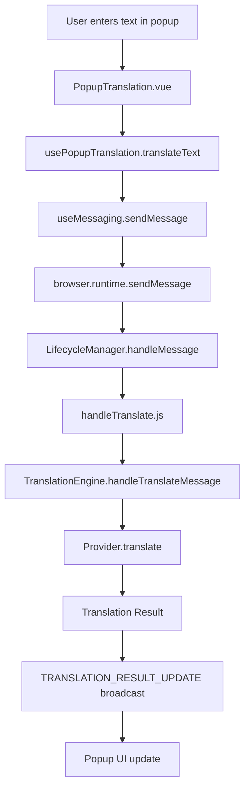
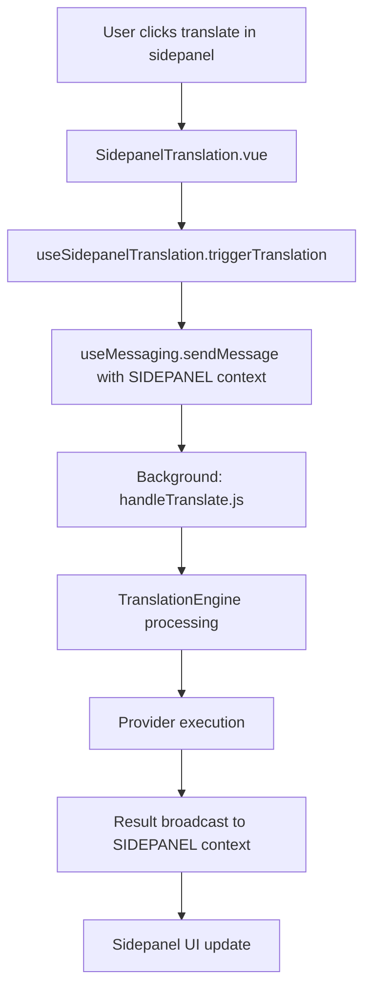
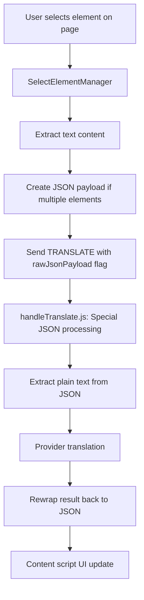

# Translation System Architecture Documentation

This document provides a comprehensive guide to the **refactored translation system** in the Translate-It browser extension. The system has been **modernized and simplified**, moving away from complex messaging classes to **direct browser API usage** with **standardized message handling**.

## 📋 Table of Contents

1. [Overview](#overview)
2. [Core Architecture](#core-architecture)
3. [Translation Flow](#translation-flow)
4. [Component Integration](#component-integration)
5. [Background Processing](#background-processing)
6. [Provider System](#provider-system)
7. [Context Separation](#context-separation)
8. [Error Handling](#error-handling)
9. [Best Practices](#best-practices)

---

## Overview

The translation system is the **core functionality** of the Translate-It extension, designed to handle translation requests from multiple contexts (sidepanel, popup, select element) through a **unified, simplified architecture**.

### 🔄 Major Refactoring Changes

**Before**: Complex messaging classes with timeout issues  
**After**: Direct browser API with standardized message formats

### Key Features

- **🎯 Unified Handler**: All translation requests flow through `handleTranslate.js`
- **🌐 Multi-Context Support**: Popup, Sidepanel, Content Script, Select Element
- **🏭 Provider System**: Extensible architecture supporting 10+ translation APIs
- **🔧 Cross-Browser Compatibility**: Chrome and Firefox MV3 support
- **⚡ Real-time Results**: Direct message broadcasting system
- **🛡️ Error Resilience**: Comprehensive error handling and recovery

---

## Core Architecture

### 1. Simplified Message Flow

```
┌─────────────────┐    ┌─────────────────┐    ┌─────────────────┐
│   UI Component  │ ── │   useMessaging  │ ── │ browser.runtime │
│                 │    │   Composable    │    │  .sendMessage() │
└─────────────────┘    └─────────────────┘    └─────────────────┘
                                                        │
                                                        ▼
┌─────────────────────────────────────────────────────────────────┐
│                    BACKGROUND SCRIPT                           │
├─────────────────────────────────────────────────────────────────┤
│  LifecycleManager → handleTranslate.js → TranslationEngine     │
└─────────────────────────────────────────────────────────────────┘
                                │
                                ▼
┌─────────────────────────────────────────────────────────────────┐
│              PROVIDER LAYER (Google, OpenAI, etc.)            │
└─────────────────────────────────────────────────────────────────┘
                                │
                                ▼
┌─────────────────────────────────────────────────────────────────┐
│               RESULT BROADCASTING                              │
│        All contexts receive TRANSLATION_RESULT_UPDATE         │
└─────────────────────────────────────────────────────────────────┘
```

### 2. Key Components

#### Frontend Layer
- **Vue Components**: `PopupTranslation.vue`, `SidepanelTranslation.vue`
- **Composables**: `usePopupTranslation.js`, `useSidepanelTranslation.js`
- **Messaging**: `useMessaging.js` composable for direct browser API usage

#### Background Layer
- **Router**: `LifecycleManager.js` - Central message router
- **Handler**: `handleTranslate.js` - Translation request processor
- **Engine**: `TranslationEngine.js` - Provider coordination
- **Providers**: Individual translation service implementations

---

## Translation Flow

### 1️⃣ Popup Translation Flow



**Code Example - Popup Translation:**

```javascript
// PopupTranslation.vue
import { usePopupTranslation } from '@/composables/usePopupTranslation.js'

export default {
  setup() {
    const { translateText, isTranslating, translationResult } = usePopupTranslation()
    
    const handleTranslate = async () => {
      try {
        const result = await translateText({
          text: inputText.value,
          sourceLang: 'auto',
          targetLang: settingsStore.settings.TARGET_LANGUAGE
        })
        
        // Result automatically updates via TRANSLATION_RESULT_UPDATE
      } catch (error) {
        console.error('Translation failed:', error)
      }
    }
    
    return { handleTranslate, isTranslating, translationResult }
  }
}
```

### 2️⃣ Sidepanel Translation Flow



**Code Example - Sidepanel Translation:**

```javascript
// useSidepanelTranslation.js
import { useMessaging } from '@/messaging/composables/useMessaging.js'
import { MessageActions } from '@/messaging/core/MessageActions.js'
import { MessagingContexts } from '@/messaging/core/MessagingCore.js'

export const useSidepanelTranslation = () => {
  const { sendMessage } = useMessaging()
  
  const triggerTranslation = async (translationData) => {
    const response = await sendMessage({
      action: MessageActions.TRANSLATE,
      data: {
        text: translationData.text,
        sourceLang: translationData.sourceLang,
        targetLang: translationData.targetLang,
        mode: 'Sidepanel_Translate'
      }
    }, MessagingContexts.SIDEPANEL)
    
    return response
  }
  
  // Context filtering for message listener
  browser.runtime.onMessage.addListener((message, sender, sendResponse) => {
    if (message.context !== MessagingContexts.SIDEPANEL) {
      return false // Not for sidepanel
    }
    
    if (message.action === MessageActions.TRANSLATION_RESULT_UPDATE) {
      // Update sidepanel UI with translation result
      updateTranslationDisplay(message.data)
    }
  })
  
  return { triggerTranslation }
}
```

### 3️⃣ Select Element Translation Flow



**Code Example - Select Element Processing:**

```javascript
// handleTranslate.js - Special SelectElement processing
if (normalizedMessage.data.mode === 'SelectElement' && 
    normalizedMessage.data.options?.rawJsonPayload) {
  
  try {
    const parsedPayload = JSON.parse(normalizedMessage.data.text)
    
    // Extract plain text from JSON structure
    let extractedText = ''
    if (Array.isArray(parsedPayload)) {
      extractedText = parsedPayload.map(item => item.text).join('
')
    } else if (parsedPayload.text) {
      extractedText = parsedPayload.text
    }
    
    // Translate plain text
    const translationResult = await translatePlainText(extractedText)
    
    // Rewrap result back to JSON format
    const wrappedResult = wrapTranslationToJson(parsedPayload, translationResult)
    
    return wrappedResult
  } catch (jsonError) {
    logger.error('JSON processing failed:', jsonError)
    // Fallback to plain text translation
  }
}
```

---

## Component Integration

### 1. Vue Composables

Each UI context has its dedicated composable:

#### usePopupTranslation.js
```javascript
export const usePopupTranslation = () => {
  const { sendMessage } = useMessaging()
  const isTranslating = ref(false)
  const translationResult = ref(null)
  
  const translateText = async (data) => {
    isTranslating.value = true
    try {
      const response = await sendMessage({
        action: MessageActions.TRANSLATE,
        data: { ...data, mode: 'Popup_Translate' }
      }, MessagingContexts.POPUP)
      
      return response
    } finally {
      isTranslating.value = false
    }
  }
  
  return { translateText, isTranslating, translationResult }
}
```

#### useSidepanelTranslation.js
```javascript
export const useSidepanelTranslation = () => {
  // Context-specific translation logic
  // Message filtering to prevent popup interference
  
  browser.runtime.onMessage.addListener((message) => {
    if (message.context !== MessagingContexts.SIDEPANEL) {
      return false // Ignore non-sidepanel messages
    }
    // Handle sidepanel-specific translation updates
  })
}
```

### 2. Context Separation

**Problem Solved**: Previously, translation results would appear in both popup and sidepanel simultaneously.

**Solution**: Context filtering in message listeners:

```javascript
// Each component filters messages by context
browser.runtime.onMessage.addListener((message, sender, sendResponse) => {
  // Only handle messages for this context
  if (message.context !== MessagingContexts.SIDEPANEL) {
    return false
  }
  
  // Process sidepanel-specific messages
  if (message.action === MessageActions.TRANSLATION_RESULT_UPDATE) {
    updateSidepanelUI(message.data)
  }
})
```

---

## Background Processing

### 1. LifecycleManager - Message Router

```javascript
// src/managers/core/LifecycleManager.js
class LifecycleManager {
  constructor() {
    this.messageHandlers = {
      'TRANSLATE': Handlers.handleTranslate,
      'ping': Handlers.handlePing,
      // ... other handlers
    }
  }
  
  async handleMessage(message, sender, sendResponse) {
    const handler = this.messageHandlers[message.action]
    if (handler) {
      return await handler(message, sender, sendResponse)
    }
    
    console.warn('No handler for action:', message.action)
    return MessageFormat.createResponse(false, null, { 
      message: 'Unknown action' 
    })
  }
}
```

### 2. handleTranslate.js - Translation Hub

**Location**: `src/background/handlers/translation/handleTranslate.js`

**Role**: Central processor for ALL translation requests

```javascript
export const handleTranslate = async (message, sender, sendResponse) => {
  try {
    logger.debug(`[TRANSLATE] Processing request from context: ${message.context}`)
    
    // 1. Validate message format
    if (!MessageFormat.validate(message)) {
      throw new Error('Invalid message format')
    }
    
    // 2. Special processing for SelectElement JSON payloads
    if (message.data.mode === 'SelectElement' && 
        message.data.options?.rawJsonPayload) {
      // Handle JSON extraction and rewrapping
    }
    
    // 3. Route to TranslationEngine
    const translationEngine = globalThis.backgroundService.translationEngine
    const result = await translationEngine.handleTranslateMessage(message, sender)
    
    // 4. Broadcast result to appropriate context
    if (sender.tab?.id) {
      await browser.tabs.sendMessage(sender.tab.id, 
        MessageFormat.create(
          MessageActions.TRANSLATION_RESULT_UPDATE,
          result,
          message.context
        )
      )
    }
    
    sendResponse(MessageFormat.createResponse(true, result))
  } catch (error) {
    logger.error('[TRANSLATE] Processing failed:', error)
    sendResponse(MessageFormat.createResponse(false, null, {
      message: error.message,
      code: 'TRANSLATION_ERROR'
    }))
  }
  
  return true
}
```

---

## Provider System

### 1. Provider Factory

```javascript
// src/services/translation/providers/ProviderFactory.js
export class ProviderFactory {
  static getProvider(providerType) {
    switch (providerType) {
      case 'google-translate':
        return new GoogleTranslateProvider()
      case 'openai':
        return new OpenAIProvider()
      case 'deepseek':
        return new DeepSeekProvider()
      default:
        throw new Error(`Unknown provider: ${providerType}`)
    }
  }
}
```

### 2. Provider Interface

All providers implement a standard interface:

```javascript
class BaseProvider {
  async translate(options) {
    const { text, sourceLang, targetLang } = options
    
    // Provider-specific implementation
    const result = await this.performTranslation(text, sourceLang, targetLang)
    
    return {
      translatedText: result.text,
      sourceLanguage: result.detectedLanguage || sourceLang,
      targetLanguage: targetLang,
      provider: this.name,
      timestamp: Date.now()
    }
  }
}
```

### 3. Translation Engine Coordination

```javascript
// src/services/translation/TranslationEngine.js
export class TranslationEngine {
  async handleTranslateMessage(message, sender) {
    const { text, sourceLang, targetLang, provider } = message.data
    
    // Get configured provider
    const translationProvider = ProviderFactory.getProvider(
      provider || this.getDefaultProvider()
    )
    
    // Perform translation
    const result = await translationProvider.translate({
      text,
      sourceLang,
      targetLang
    })
    
    // Add metadata
    result.mode = message.data.mode
    result.context = message.context
    result.originalText = text
    
    return result
  }
}
```

---

## Context Separation

### Problem & Solution

**❌ Before**: Translation results appeared in multiple components simultaneously

**✅ After**: Context-based message filtering ensures proper component isolation

### Implementation

```javascript
// Popup component - only receives POPUP context messages
browser.runtime.onMessage.addListener((message) => {
  if (message.context !== MessagingContexts.POPUP) {
    return false // Ignore non-popup messages
  }
  
  if (message.action === MessageActions.TRANSLATION_RESULT_UPDATE) {
    updatePopupTranslation(message.data)
  }
})

// Sidepanel component - only receives SIDEPANEL context messages  
browser.runtime.onMessage.addListener((message) => {
  if (message.context !== MessagingContexts.SIDEPANEL) {
    return false // Ignore non-sidepanel messages
  }
  
  if (message.action === MessageActions.TRANSLATION_RESULT_UPDATE) {
    updateSidepanelTranslation(message.data)
  }
})
```

---

## Error Handling

### 1. Standardized Error Responses

```javascript
// Error response format
{
  success: false,
  error: {
    message: 'Provider authentication failed',
    code: 'PROVIDER_AUTH_ERROR',
    details: { provider: 'openai', statusCode: 401 }
  },
  messageId: 'translate-12345',
  timestamp: 1672531200000
}
```

### 2. Provider Error Handling

```javascript
// In provider implementations
async translate(options) {
  try {
    const result = await this.apiCall(options)
    return this.formatSuccess(result)
  } catch (error) {
    if (error.status === 401) {
      throw new Error('Provider authentication failed')
    } else if (error.status === 429) {
      throw new Error('Rate limit exceeded')
    } else {
      throw new Error(`Translation failed: ${error.message}`)
    }
  }
}
```

### 3. UI Error Handling

```javascript
// In Vue composables
const translateText = async (data) => {
  try {
    const response = await sendMessage({
      action: MessageActions.TRANSLATE,
      data
    })
    
    if (!response.success) {
      throw new Error(response.error.message)
    }
    
    return response.data
  } catch (error) {
    // Show user-friendly error message
    showErrorNotification(error.message)
    throw error
  }
}
```

---

## Best Practices

### 1. Message Design
- ✅ Use `MessageActions` constants for consistency
- ✅ Include context for proper routing
- ✅ Validate messages with `MessageFormat.validate()`
- ❌ Don't send large payloads in messages

### 2. Context Separation
- ✅ Filter messages by context in listeners
- ✅ Use appropriate `MessagingContexts` values
- ❌ Don't assume all components need all messages

### 3. Error Handling
- ✅ Provide meaningful error messages
- ✅ Include error codes for programmatic handling
- ✅ Log errors with appropriate detail level
- ❌ Don't expose internal error details to users

### 4. Performance
- ✅ Use context filtering to reduce message processing
- ✅ Avoid unnecessary message broadcasts
- ✅ Cache translation results when appropriate
- ❌ Don't create message loops

---

## Key Files

### Core Translation Files
- `src/background/handlers/translation/handleTranslate.js` - Central translation processor
- `src/services/translation/TranslationEngine.js` - Provider coordination
- `src/services/translation/providers/` - Individual provider implementations

### Frontend Integration
- `src/composables/usePopupTranslation.js` - Popup translation logic
- `src/composables/useSidepanelTranslation.js` - Sidepanel translation logic
- `src/messaging/composables/useMessaging.js` - Core messaging utilities

### Background Infrastructure
- `src/managers/core/LifecycleManager.js` - Message routing
- `src/messaging/core/MessagingCore.js` - Message format utilities
- `src/messaging/core/MessageActions.js` - Action constants

---

## Summary

The refactored translation system provides:

- **🎯 Centralized Processing**: All translations flow through `handleTranslate.js`
- **🔧 Simplified Architecture**: Direct browser API usage instead of complex classes
- **🌐 Context Isolation**: Components only receive relevant messages
- **⚡ Better Performance**: Eliminated timeout issues and reduced overhead
- **🛡️ Robust Error Handling**: Comprehensive error management throughout the pipeline

**Key Insight**: The translation system is now **simpler, faster, and more maintainable** while preserving all functionality and adding better component isolation.

#### Translation Engine: `translation-engine.js`
**Location:** `src/background/translation-engine.js`

**Role:** Translation orchestration and provider management

**Key Responsibilities:**
- Provider selection and instantiation
- Translation request processing
- History management
- Cache coordination

### 2. Frontend Translation Services

#### TranslationService Class
**Location:** `src/core/TranslationService.js`

**Role:** High-level translation API for Vue components

**Supported Methods:**
```javascript
// Sidepanel translations
await translationService.sidepanelTranslate(text, sourceLang, targetLang);

// Popup translations  
await translationService.popupTranslate(text, sourceLang, targetLang);

// Select element mode activation
await translationService.activateSelectElementMode(true);
```

#### Vue Composables
**Locations:**
- `src/composables/useSidepanelTranslation.js`
- `src/composables/usePopupTranslation.js`

**Role:** Vue-specific translation logic with reactive state management

### 3. Messaging System Integration

#### TranslationMessenger
**Location:** `src/messaging/specialized/TranslationMessenger.js`

**Role:** Specialized messaging for translation operations

#### EnhancedUnifiedMessenger
**Location:** `src/core/EnhancedUnifiedMessenger.js`

**Role:** Cross-browser messaging with Firefox MV3 compatibility

---

## Translation Pathways

### 1️⃣ Sidepanel Translation Pathway


**Detailed Flow:**

1. **User Interaction**: User enters text and clicks translate button in sidepanel
2. **Vue Composable**: `useSidepanelTranslation.triggerTranslation()` is called
3. **Service Layer**: `TranslationService.sidepanelTranslate()` formats the request
4. **Messaging Layer**: `TranslationMessenger.translate()` creates standardized message
5. **Cross-Browser Layer**: `EnhancedUnifiedMessenger` handles browser compatibility
6. **Background Processing**: `handleTranslate.js` receives and validates the message
7. **Translation Engine**: Routes to appropriate provider via `TranslationEngine`
8. **Provider Execution**: Actual translation performed by selected provider
9. **Result Broadcasting**: `TRANSLATION_RESULT_UPDATE` sent to all contexts
10. **UI Update**: Vue component receives result and updates interface

### 2️⃣ Popup Translation Pathway

```mermaid
graph TD
    A[User clicks Translate in popup] --> B[usePopupTranslation.triggerTranslation]
    B --> C[TranslationService.popupTranslate]
    C --> D[Same pathway as sidepanel]
    D --> E[handleTranslate.js 🎯]
    E --> F[Translation Engine]
    F --> G[Provider execution]
    G --> H[Result broadcast]
    H --> I[Popup UI update]
```



**Key Differences from Sidepanel:**
- Uses `usePopupTranslation` composable
- Context is `popup` instead of `sidepanel`
- Smaller UI footprint considerations
- Same underlying pathway through `handleTranslate.js`

### 3️⃣ Select Element Translation Pathway

```mermaid
graph TD
    A[User selects text on webpage] --> B[EventHandler.handleAction]
    B --> C[Text extraction from DOM]
    C --> D[expandTextsForTranslation]
    D --> E[JSON payload creation]
    E --> F[Message to background]
    F --> G[handleTranslate.js 🎯]
    G --> H[JSON payload parsing]
    H --> I[Plain text extraction]
    I --> J[Translation Engine]
    J --> K[Provider execution]
    K --> L[Result rewrapping to JSON]
    L --> M[Content script result]
    M --> N[DOM translation application]
```



**Detailed Select Element Flow:**

1. **User Selection**: User selects text/elements on a webpage
2. **Event Detection**: `EventHandler` detects selection and triggers translation
3. **Text Extraction**: `extractTextFromElements()` extracts text from selected DOM elements
4. **Text Expansion**: `expandTextsForTranslation()` processes and organizes text
5. **JSON Payload**: Creates JSON structure: `[{text: "extracted text"}]`
6. **Background Message**: Sends to `handleTranslate.js` with `rawJsonPayload: true`
7. **JSON Parsing**: `handleTranslate.js` parses JSON and extracts plain text
8. **Translation**: Same provider-based translation as other modes
9. **Result Rewrapping**: Translated text wrapped back into JSON format
10. **DOM Application**: Content script applies translations to original elements

**Select Element Special Handling in handleTranslate.js:**

```javascript
// Lines 42-59: JSON payload parsing
if (normalizedMessage.data.mode === 'SelectElement' && 
    normalizedMessage.data.options?.rawJsonPayload) {
  
  const parsedPayload = JSON.parse(normalizedMessage.data.text);
  let extractedText = '';
  
  if (Array.isArray(parsedPayload)) {
    extractedText = parsedPayload.map(item => item.text).join('\n');
  } else if (parsedPayload?.text) {
    extractedText = parsedPayload.text;
  }
  
  normalizedMessage.data.text = extractedText;
}

// Lines 83-87: Result rewrapping
if (normalizedMessage.data.mode === 'SelectElement' && 
    normalizedMessage.data.options?.rawJsonPayload) {
  
  finalTranslatedText = JSON.stringify([{ text: result.translatedText }]);
}
```

---

## Message Flow Architecture

### Message Structure

All translation messages follow the standardized `MessageFormat`:

```javascript
{
  action: "TRANSLATE",
  data: {
    text: "Text to translate",
    provider: "google-translate",
    sourceLanguage: "en",
    targetLanguage: "fa",
    mode: "Sidepanel_Translate", // or "SelectElement"
    options: {
      rawJsonPayload: false, // true for SelectElement
      messageId: "unique-id"
    }
  },
  context: "sidepanel", // or "popup", "content", etc.
  timestamp: 1640995200000,
  messageId: "sidepanel-translate-1640995200000"
}
```

### Response Structure

Translation results are broadcast using `TRANSLATION_RESULT_UPDATE`:

```javascript
{
  action: "TRANSLATION_RESULT_UPDATE",
  data: {
    translatedText: "متن ترجمه شده",
    originalText: "Original text",
    provider: "google-translate",
    sourceLanguage: "en",
    targetLanguage: "fa",
    timestamp: 1640995200000,
    mode: "Sidepanel_Translate"
  },
  context: "sidepanel",
  messageId: "sidepanel-translate-1640995200000"
}
```

---

## handleTranslate.js - The Translation Hub

### Core Functionality

`handleTranslate.js` is the **absolute center** of the translation system. **Every single translation request** from any context passes through this handler.

**Location:** `src/background/handlers/translation/handleTranslate.js`

### Key Responsibilities

#### 1. Message Validation & Normalization
```javascript
// Validates incoming message format
if (!MessageFormat.validate(message)) {
  throw new Error(`Invalid message format received: ${JSON.stringify(message)}`);
}

// Ensures correct action type
if (message.action !== MessageActions.TRANSLATE) {
  throw new Error(`Unexpected action: ${message.action}`);
}
```

#### 2. SelectElement Mode Processing
```javascript
// Special handling for SelectElement JSON payloads
if (normalizedMessage.data.mode === 'SelectElement' && 
    normalizedMessage.data.options?.rawJsonPayload) {
  
  try {
    const parsedPayload = JSON.parse(normalizedMessage.data.text);
    // Extract plain text from JSON structure
    let extractedText = '';
    if (Array.isArray(parsedPayload)) {
      extractedText = parsedPayload.map(item => item.text).join('\n');
    }
    normalizedMessage.data.text = extractedText;
  } catch (jsonParseError) {
    throw new Error(`Failed to parse SelectElement JSON: ${jsonParseError.message}`);
  }
}
```

#### 3. Translation Engine Coordination
```javascript
// Routes to translation engine
const result = await backgroundService.translationEngine.handleTranslateMessage(normalizedMessage, sender);

// Validates translation result
if (!result || typeof result !== 'object' || !result.hasOwnProperty('success')) {
  throw new Error(`Invalid response from translation engine: ${JSON.stringify(result)}`);
}
```

#### 4. Result Broadcasting System
```javascript
// Broadcasts results to all contexts for Firefox MV3 compatibility
if (result.success && result.translatedText) {
  const targetTabId = sender.tab?.id;
  
  // Rewrap SelectElement results
  let finalTranslatedText = result.translatedText;
  if (normalizedMessage.data.mode === 'SelectElement' && 
      normalizedMessage.data.options?.rawJsonPayload) {
    finalTranslatedText = JSON.stringify([{ text: result.translatedText }]);
  }
  
  const updateMessage = MessageFormat.create(
    MessageActions.TRANSLATION_RESULT_UPDATE,
    {
      translatedText: finalTranslatedText,
      originalText: result.originalText,
      provider: result.provider,
      sourceLanguage: result.sourceLanguage,
      targetLanguage: result.targetLanguage,
      timestamp: result.timestamp,
      mode: result.mode
    },
    message.context,
    { messageId: message.messageId }
  );
  
  // Send to specific tab or broadcast
  if (targetTabId) {
    browser.tabs.sendMessage(targetTabId, updateMessage);
  } else {
    browser.runtime.sendMessage(updateMessage);
  }
}
```

### Impact Assessment

#### 💯 Sidepanel Impact: **COMPLETE**
- All sidepanel translations pass through this handler
- Message validation and error handling
- Result broadcasting to Vue components
- **No sidepanel translation works without this handler**

#### 💯 Popup Impact: **COMPLETE**
- All popup translations pass through this handler
- Context-aware processing for popup
- Same validation and broadcasting system
- **No popup translation works without this handler**

#### 💯 Select Element Impact: **COMPLETE + SPECIALIZED**
- All select element translations pass through this handler
- **Special JSON payload processing** (lines 42-59)
- **Special result rewrapping** (lines 83-87)
- Critical for DOM element translation workflow
- **No select element translation works without this handler**

---

## Provider System Integration

### Provider Architecture

The translation system supports multiple providers through a factory pattern:

#### Supported Providers
1. **Google Translate** (Free, no API key required)
2. **Google Gemini** (AI-powered with context understanding)
3. **Microsoft Bing Translate** (Free tier available)
4. **OpenAI** (GPT models)
5. **OpenRouter** (Multiple AI models)
6. **DeepSeek** (AI translation service)
7. **Yandex Translate** (Free tier)
8. **Browser Translation API** (Chrome 138+)
9. **WebAI** (Local server integration)
10. **Custom OpenAI-compatible APIs**

#### Provider Factory Integration
```javascript
// In TranslationEngine.handleTranslateMessage
const provider = this.factory.getProvider(data.provider || 'google-translate');
const result = await provider.translate(
  data.text,
  data.sourceLanguage,
  data.targetLanguage,
  data.mode
);
```

#### Base Provider Interface
```javascript
export class BaseProvider {
  async translate(text, sourceLang, targetLang, translateMode) {
    throw new Error('translate method must be implemented');
  }
  
  async translateImage(imageData, sourceLang, targetLang, translateMode) {
    throw new Error('translateImage not supported by this provider');
  }
  
  async testConnection() {
    // Base implementation with API key validation
  }
}
```

---

## Cross-Browser Compatibility

### Firefox MV3 Compatibility

The translation system includes special handling for Firefox MV3 service worker limitations:

#### Enhanced Unified Messenger
```javascript
// Firefox detection and compatibility mode
if (this.firefoxCompatibilityMode) {
  return await this.handleFirefoxMV3Message(enhancedMessage, timeout);
}
```

#### Result Broadcasting Strategy
Due to Firefox MV3 service worker limitations, the system uses a **broadcasting approach**:

1. **Chrome**: Direct response handling through promises
2. **Firefox**: Broadcast `TRANSLATION_RESULT_UPDATE` messages to all contexts
3. **Fallback**: Content script listeners for result reception

#### UnifiedMessenger Firefox Handling
```javascript
// Firefox MV3 workaround in UnifiedMessenger
if (response === undefined && firefoxDetection) {
  if (messageToSend.action === MessageActions.TRANSLATE) {
    // Listen for actual translation result
    const actualTranslationResult = await new Promise((resolveResult, rejectResult) => {
      const listener = (msg) => {
        if (msg.action === MessageActions.TRANSLATION_RESULT_UPDATE && 
            msg.context === messageToSend.context && 
            msg.messageId === messageToSend.messageId) {
          browser.runtime.onMessage.removeListener(listener);
          resolveResult(msg);
        }
      };
      browser.runtime.onMessage.addListener(listener);
    });
  }
}
```

---

## Error Handling & Recovery

### Multi-Layer Error Handling

#### 1. Handler Level (handleTranslate.js)
```javascript
try {
  const result = await backgroundService.translationEngine.handleTranslateMessage(normalizedMessage, sender);
  return MessageFormat.createSuccessResponse("Translation request processed", message.messageId);
} catch (translationError) {
  console.error('[Handler:TRANSLATE] Translation error:', translationError);
  
  errorHandler.handle(translationError, {
    type: ErrorTypes.TRANSLATION,
    context: "handleTranslate",
    messageData: message
  });
  
  return MessageFormat.createErrorResponse(
    translationError,
    message.messageId,
    { context: message.context || 'unknown' }
  );
}
```

#### 2. Service Level (TranslationService)
```javascript
try {
  return await this.messenger.specialized.translation.translate(payload.promptText, options);
} catch (error) {
  logME(`[TranslationService] Translation error for mode ${mode}:`, error);
  throw error;
}
```

#### 3. Composable Level (Vue Components)
```javascript
try {
  await translationService.sidepanelTranslate(sourceText.value, sourceLang, targetLang);
} catch (error) {
  console.error("[useSidepanelTranslation] Translation error:", error);
  translationError.value = error.message || "Translation failed";
  isTranslating.value = false;
}
```

### Error Types and Recovery

#### Common Error Scenarios
1. **Provider API Failures**: Automatic fallback to alternative providers
2. **Network Connectivity Issues**: Retry mechanisms with exponential backoff
3. **Invalid API Keys**: Clear error messages and configuration guidance
4. **Rate Limiting**: Queue management and throttling
5. **JSON Parsing Errors**: Graceful fallback for SelectElement mode

#### Error Recovery Strategies
- **Provider Fallback**: Automatic switch to backup providers
- **Retry Logic**: Exponential backoff for transient errors
- **User Notification**: Clear error messages in UI
- **State Recovery**: Proper cleanup of loading states

---

## Performance Considerations

### Optimization Strategies

#### 1. Message Efficiency
- **Structured Messages**: Standardized format reduces parsing overhead
- **Context Routing**: Direct routing prevents unnecessary processing
- **Payload Optimization**: Minimal data transfer for select element JSON

#### 2. Provider Caching
```javascript
// Provider instance caching in ProviderFactory
getProvider(providerName) {
  if (this.providerCache.has(providerName)) {
    return this.providerCache.get(providerName);
  }
  
  const provider = this.createProvider(providerName);
  this.providerCache.set(providerName, provider);
  return provider;
}
```

#### 3. Translation Caching
- **Result Caching**: Recent translations cached to avoid duplicate API calls
- **History Integration**: Previously translated content retrieved from history
- **Smart Invalidation**: Cache invalidation based on provider and language changes

#### 4. Memory Management
- **Cleanup Listeners**: Proper removal of message listeners
- **WeakMap Usage**: Garbage collection friendly data structures
- **Timeout Management**: Automatic cleanup of pending requests

### Performance Metrics

#### Bundle Size Targets
- **Popup Translation**: < 6KB
- **Sidepanel Translation**: < 8KB  
- **Content Script**: < 100KB (current: ~900KB, optimization ongoing)

#### Response Time Goals
- **Simple Translation**: < 2 seconds
- **Select Element**: < 3 seconds
- **Provider Switching**: < 500ms

---

## Development Guidelines

### Adding New Translation Contexts

#### 1. Create Context-Specific Composable
```javascript
// src/composables/useNewContextTranslation.js
export function useNewContextTranslation() {
  const translationService = new TranslationService(MessagingContexts.NEW_CONTEXT);
  
  const triggerTranslation = async () => {
    await translationService.translate(TranslationMode.NewContext_Translate, {
      promptText: text,
      sourceLanguage: sourceLang,
      targetLanguage: targetLang
    });
  };
  
  return { triggerTranslation };
}
```

#### 2. Add Context to MessagingContexts
```javascript
// src/messaging/core/MessagingCore.js
export const MessagingContexts = {
  // ... existing contexts
  NEW_CONTEXT: 'new-context'
};
```

#### 3. Register Translation Mode
```javascript
// src/config.js
export const TranslationMode = {
  // ... existing modes
  NewContext_Translate: 'NewContext_Translate'
};
```

#### 4. Update handleTranslate.js (if needed)
Most new contexts work automatically through the existing pipeline. Special handling only needed for unique data formats.

### Adding New Translation Providers

#### 1. Implement Provider Class
```javascript
// src/providers/implementations/custom/NewProvider.js
import { BaseProvider } from '../../core/BaseProvider.js';

export class NewProvider extends BaseProvider {
  constructor() {
    super('new-provider');
  }
  
  async translate(text, sourceLang, targetLang, translateMode) {
    // Implementation
    return translatedText;
  }
  
  async testConnection() {
    // Test API connectivity
    return { success: true };
  }
}
```

#### 2. Register Provider
```javascript
// src/providers/core/ProviderRegistry.js
import { NewProvider } from '../implementations/custom/NewProvider.js';

providerRegistry.register('new-provider', NewProvider, {
  name: 'New Provider',
  supportedFeatures: ['text', 'image']
});
```

#### 3. Add Configuration UI
Create components in `src/components/feature/api-settings/` for provider-specific settings.

### Testing Translation Flow

#### Unit Tests
```javascript
// Test translation service
describe('TranslationService', () => {
  test('should handle sidepanel translation', async () => {
    const service = new TranslationService(MessagingContexts.SIDEPANEL);
    const result = await service.sidepanelTranslate('Hello', 'en', 'fa');
    expect(result).toBeDefined();
  });
});
```

#### Integration Tests
```javascript
// Test complete translation flow
describe('Translation Flow', () => {
  test('should complete sidepanel to provider translation', async () => {
    // Mock provider response
    // Trigger translation from UI
    // Verify result received
  });
});
```

#### E2E Tests
```javascript
// Test UI to translation completion
test('should translate text in sidepanel', async ({ page }) => {
  await page.goto('chrome-extension://id/html/sidepanel.html');
  await page.fill('#source-text', 'Hello World');
  await page.click('#translate-button');
  await expect(page.locator('#translated-text')).toContainText('سلام دنیا');
});
```

---

## Troubleshooting Common Issues

### Translation Not Working

#### Checklist
1. **Background Service**: Verify background service worker is running
2. **Provider Configuration**: Check API keys and provider settings
3. **Message Routing**: Verify `handleTranslate.js` is receiving messages
4. **Network Connectivity**: Test provider API connectivity
5. **Context Communication**: Check message passing between contexts

#### Debug Steps
```javascript
// Enable debug logging
if (import.meta.env.DEV) {
  console.debug('[Translation Debug] Message sent:', message);
}

// Check handleTranslate.js logs
console.log('[Handler:TRANSLATE] Raw message received:', message);

// Verify provider response
console.log('[TranslationEngine] Translation result:', result);
```

### SelectElement Mode Issues

#### Common Problems
1. **JSON Parsing Errors**: Invalid JSON structure from content script
2. **DOM Text Extraction**: Incorrect text extraction from elements
3. **Result Application**: Translation not applied to DOM elements

#### Solutions
```javascript
// Validate JSON payload
try {
  const parsedPayload = JSON.parse(normalizedMessage.data.text);
  if (!Array.isArray(parsedPayload)) {
    throw new Error('Expected array format');
  }
} catch (error) {
  console.error('JSON parsing failed:', error);
}
```

### Firefox MV3 Compatibility Issues

#### Symptoms
- Translations work in Chrome but not Firefox
- `undefined` responses from background script
- Message listeners not receiving results

#### Solutions
- Verify `TRANSLATION_RESULT_UPDATE` broadcasting is working
- Check Firefox compatibility mode detection
- Ensure message listeners are properly registered

---

## Architecture Diagrams

### Complete Translation System Overview

```
┌─────────────────────────────────────────────────────────────────┐
│                        USER INTERFACES                          │
├─────────────────┬─────────────────┬─────────────────────────────┤
│   Sidepanel     │     Popup       │    Select Element (Content) │
│                 │                 │                             │
│ Vue Components  │ Vue Components  │   EventHandler              │
│ ↓               │ ↓               │   ↓                         │
│ useSidepanel    │ usePopup        │   Text Extraction           │
│ Translation     │ Translation     │   ↓                         │
│ ↓               │ ↓               │   JSON Payload Creation     │
└─────────────────┴─────────────────┴─────────────────────────────┘
                           ↓
┌─────────────────────────────────────────────────────────────────┐
│                     MESSAGING LAYER                            │
├─────────────────────────────────────────────────────────────────┤
│                  TranslationService                            │
│                           ↓                                     │
│                TranslationMessenger                            │
│                           ↓                                     │
│              EnhancedUnifiedMessenger                          │
│                           ↓                                     │
│                browser.runtime.sendMessage                     │
└─────────────────────────────────────────────────────────────────┘
                           ↓
┌─────────────────────────────────────────────────────────────────┐
│                   BACKGROUND SERVICE                            │
├─────────────────────────────────────────────────────────────────┤
│                  SimpleMessageHandler                          │
│                           ↓                                     │
│              🎯 handleTranslate.js 🎯                          │
│                           ↓                                     │
│                 TranslationEngine                              │
│                           ↓                                     │
│                  ProviderFactory                               │
└─────────────────────────────────────────────────────────────────┘
                           ↓
┌─────────────────────────────────────────────────────────────────┐
│                   PROVIDER LAYER                               │
├─────────────────────────────────────────────────────────────────┤
│  Google    │  OpenAI   │  Bing    │  Yandex  │  DeepSeek  │ ... │
│ Translate  │           │          │          │            │     │
└─────────────────────────────────────────────────────────────────┘
                           ↓
┌─────────────────────────────────────────────────────────────────┐
│                    RESULT FLOW                                 │
├─────────────────────────────────────────────────────────────────┤
│               Translation Result                               │
│                           ↓                                     │
│           handleTranslate: Result Processing                   │
│                           ↓                                     │
│      TRANSLATION_RESULT_UPDATE Broadcasting                    │
│                           ↓                                     │
│              UI Updates (All Contexts)                        │
└─────────────────────────────────────────────────────────────────┘
```

### handleTranslate.js Internal Flow

```
┌─────────────────────────────────────────────────────────────────┐
│                   handleTranslate.js                           │
├─────────────────────────────────────────────────────────────────┤
│  1. Message Validation                                         │
│     ├─ MessageFormat.validate()                               │
│     └─ Action type verification                               │
│                           ↓                                     │
│  2. SelectElement Special Processing                           │
│     ├─ Check rawJsonPayload flag                              │
│     ├─ JSON.parse(message.data.text)                          │
│     └─ Extract plain text from JSON                           │
│                           ↓                                     │
│  3. Translation Engine Routing                                │
│     ├─ backgroundService.translationEngine                    │
│     └─ handleTranslateMessage(normalizedMessage, sender)      │
│                           ↓                                     │
│  4. Result Processing                                          │
│     ├─ Validate translation result                            │
│     ├─ SelectElement: Rewrap to JSON                          │
│     └─ Create TRANSLATION_RESULT_UPDATE message               │
│                           ↓                                     │
│  5. Result Broadcasting                                        │
│     ├─ Send to specific tab (if available)                    │
│     ├─ Fallback to runtime.sendMessage                       │
│     └─ Error handling for failed broadcasts                   │
└─────────────────────────────────────────────────────────────────┘
```

---

## Conclusion

The translation system is a sophisticated, multi-layered architecture designed for:

- **🎯 Centralized Processing**: All translations flow through `handleTranslate.js`
- **🔧 Extensibility**: Easy addition of new providers and contexts
- **🌐 Cross-Browser Support**: Chrome and Firefox MV3 compatibility
- **⚡ Performance**: Efficient messaging and caching strategies
- **🛡️ Reliability**: Comprehensive error handling and recovery

**Key Takeaway**: `handleTranslate.js` is the **absolute core** of the translation system. Every translation request, regardless of source (sidepanel, popup, select element), passes through this handler. Understanding this file and its integration with the TranslationEngine is crucial for any translation-related development or debugging.

For AI systems working with this codebase: **Always consider the complete flow from UI component → TranslationService → Messaging → handleTranslate.js → TranslationEngine → Provider → Result Broadcasting → UI Update** when implementing translation features or debugging issues.