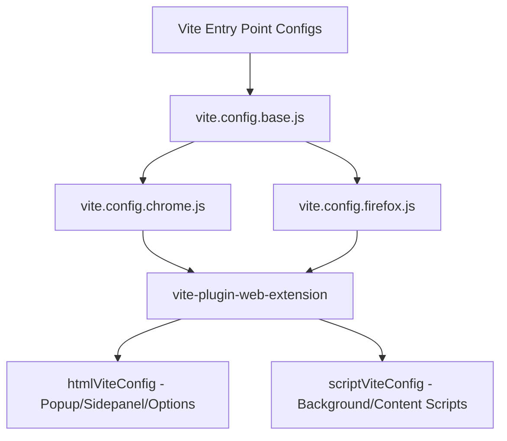

# Vite Build & Bundling System Guide

This document describes the design, architecture, and configuration of the translation extension's build system powered by **Vite**, **Rolldown (Vite 8)**, and **Rollup**.

---

## 1. Overview & Architecture

The extension is a modular, multi-context browser application. Because it executes across isolated layers (Popup, Options Page, Sidepanel, Background Service Worker, Content Scripts, and Iframes), the build system must output extremely precise, optimized, and robust bundles while respecting Manifest V3 and browser CSP (Content Security Policy) standards.



### Build Entry Points
The project maintains three core configurations under `config/vite/`:
*   **`vite.config.base.js`**: Defines the shared ecosystem, aliases, CSS preprocessors, minification parameters, manual chunks routing, and custom logger filters.
*   **`vite.config.chrome.js`**: Integrates `vite-plugin-web-extension` to compile the Chrome-specific manifest, background service worker, and assets.
*   **`vite.config.firefox.js`**: Tailors assets, manifest configurations, and HTML file structure for Firefox compliance.

---

## 1.1. Content Script CSS Ownership

The content UI is rendered entirely inside a Shadow DOM.

To preserve Shadow DOM isolation, Content UI styles are injected manually
into the ShadowRoot at runtime.

Although Vite extracts component SCSS into CSS assets, the auto-generated
CSS for the main content script is intentionally removed from the final
manifest during `transformManifest()`. Otherwise, the browser would inject
those styles into the host page through `manifest.content_scripts[].css`,
bypassing Shadow DOM isolation.

This results in a clear ownership model:

- **Content UI styles** → ShadowRoot only.
- **Page-facing styles** (Element Selection, Mouse Hover, Page Translation
  layout fixes, iframe highlights, etc.) → Explicit page-style injection.

### Design Rule

Never rely on `manifest.content_scripts[].css` for Content UI styling.

Any style that must affect the host page should be injected explicitly
through its own page-style injection mechanism.

> This behavior is intentional and should not be reverted unless the Content UI architecture changes.

---

## 2. Manual Chunking Strategy (`manualChunks`)

In a multi-page browser extension, letting the bundler split code dynamically without guidance results in fragmented, duplicated code across chunks, causing critical circular dependencies and runtime crashes (Temporal Dead Zone errors). 

To prevent this, the base configuration implements a strict **Manual Chunking Topology** in `rollupOptions.output.manualChunks`:

```javascript
// config/vite/vite.config.base.js
manualChunks: (id) => {
  // 1. Vendor libraries (Vue, Pinia, VueUse, etc.)
  if (id.includes('node_modules')) {
    if (id.includes('vue') && !id.includes('vue-router')) return 'vendor/vue-core';
    if (id.includes('pinia')) return 'vendor/vue-core';
    return 'vendor/vendor';
  }
  
  // 2. Heavy Background Providers
  if (id.includes('src/core/background/providers/')) {
    return 'background/providers';
  }

  // 3. Isolated feature-specific chunks (Lazy by nature)
  if (id.includes('src/features/screen-capture')) return 'features/feature-capture';
  if (id.includes('src/features/subtitle-translation') || id.includes('src/apps/subtitle')) {
    return 'features/feature-subtitle';
  }

  // 4. Unified Core Systems (Crucial for execution stability)
  if (
    id.includes('src/shared/') || 
    id.includes('src/store/') || 
    id.includes('src/composables/') ||
    id.includes('src/utils/')
  ) {
    return 'core/core-shared';
  }
}
```

### Why `core/core-shared` is Mandatory:
By bundling all core services (`logging`, `storage`, `error-management`, `messaging`, and shared `composables`) into a single, synchronously loaded chunk (`core-shared.js`), we:
*   Ensure the **Structured Logger** and **Error Handler** initialize synchronously.
*   Completely eliminate cross-chunk circular references.
*   Prevent heavy feature chunks (like `feature-subtitle.js`) from leaking into other pages.

---

## 3. Dynamic Imports & Whitelist-Based Warning Suppression

### The Dynamic Import Pattern
To solve circular dependencies at bootstrap (e.g. `logger.js` loading `GlobalDebugState.js` which needs `StorageCore.js`), the extension uses asynchronous imports (`await import(...)`) inside core initialization routines like `DebugModeBridge.js`. 

### The Warning Mechanism
Because these core files are also statically imported elsewhere, the compiler warns:
> `(!) ... is dynamically imported by ... but also statically imported by ... dynamic import will not move module into another chunk.`

While safe to ignore, these warnings clutter developer terminal outputs during `pnpm run watch:chrome`.

### Surgical Whitelist Filter (The "Laser" Shield)
To maintain a quiet console while protecting the project from future bundling mistakes, we implemented a **Strict Whitelist Warning Filter** operating at both the **Vite Logger level** and the **Bundler warning hooks**.

#### Whitelist Targets:
Only these 9 intentional bootstrap files are permitted to bypass dynamic import warnings:
1.  `src/shared/logging/GlobalDebugState.js`
2.  `src/shared/error-management/ErrorTypes.js`
3.  `src/shared/storage/core/StorageCore.js`
4.  `src/shared/error-management/ErrorMatcher.js`
5.  `src/shared/error-management/ErrorHandler.js`
6.  `src/utils/i18n/LanguagePackLoader.js`
7.  `src/utils/i18n/LazyLanguageLoader.js`
8.  `src/utils/i18n/languages.js`
9.  `src/utils/i18n/i18n.js`

#### Implementation Architecture:
```javascript
// config/vite/vite.config.base.js

// 1. Vite Custom Logger Hook (Trashes internal warnings at the reporter stage)
const customLogger = createLogger();
const originalWarn = customLogger.warn;
customLogger.warn = (msg, options) => {
  if (msg.includes('DYNAMIC_IMPORT_WILL_NOT_MOVE_MODULE') || msg.includes('dynamic import will not move module')) {
    const isIntentional = allowedSuppressedFiles.some(file => msg.includes(file));
    if (isIntentional) return; // Surgical Mute
  }
  originalWarn(msg, options);
};

// 2. Bundler Hooks (Mutes compiler pipeline for both Rollup and Rolldown)
rollupOptions: {
  onwarn(warning, warn) {
    if (warning.code === 'DYNAMIC_IMPORT_WILL_NOT_MOVE_MODULE' && isIntentional(warning.message)) return;
    warn(warning);
  },
  onLog(level, log, defaultHandler) {
    if (level === 'warn' && log.code === 'DYNAMIC_IMPORT_WILL_NOT_MOVE_MODULE' && isIntentional(log.message)) return;
    defaultHandler(level, log);
  }
}
```

> [!IMPORTANT]
> If a developer accidentally adds a dynamic-static import clash in a file **not** included in this whitelist (e.g. inside `src/features/element-selection/`), the filter will evaluate `isIntentional = false` and the warning **will still be printed loud and clear** to alert the team.

---

## 4. Developer Workflow Commands

### Active Compilation Commands:
*   **`pnpm run watch:chrome`**: Development watch compiler for Chrome. Instantly compiles changes in the background, mutes intentional logger warnings, and keeps the terminal completely clean.
*   **`pnpm run watch:firefox`**: Tailored watch mode with live hot-reloading path corrections for Firefox.
*   **`pnpm run build`**: Production compiler, applying minification via Terser, dropping console logs, and splitting static assets.

---

## Summary of Best Practices for Future Developers

1.  **Do Not Modify `manualChunks` Core Filters**: Unless adding a new standalone page or utility with complex requirements, let `core/core-shared` handle the shared services to prevent TDZ Errors.
2.  **Add Intentional dynamic imports to Whitelist**: If a circular dependency requires `await import` on a core file, add its path to the `allowedSuppressedFiles` array in `vite.config.base.js`.
3.  **Audit Non-Whitelisted Warnings**: If a warning appears during compilation, inspect it immediately — it represents a real dependency conflict or bundling mistake.

**Last Updated:** May 2026
