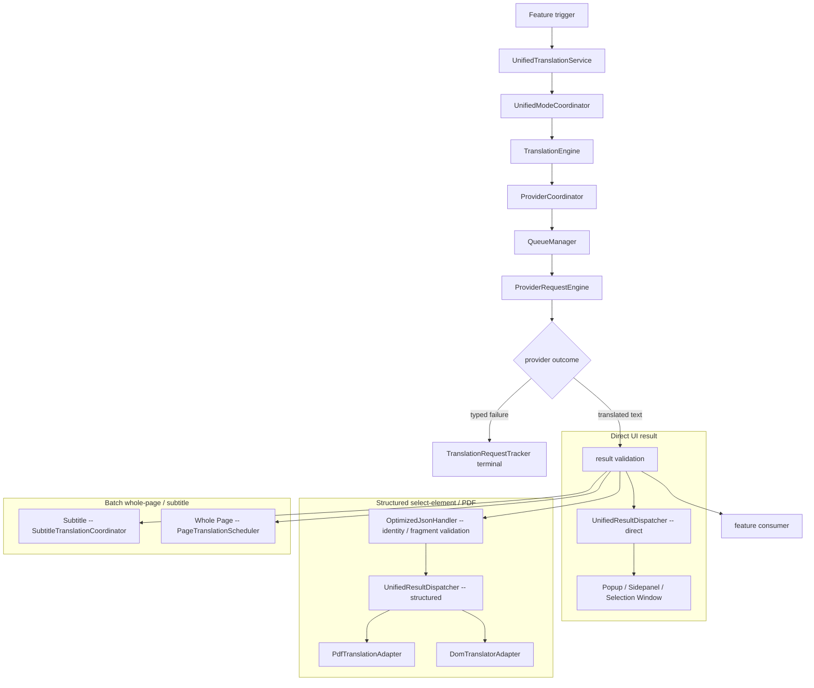
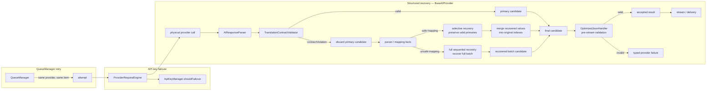
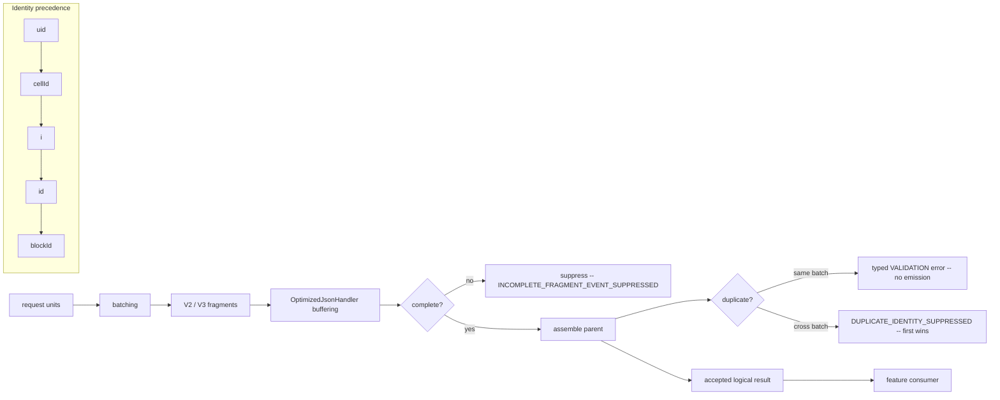
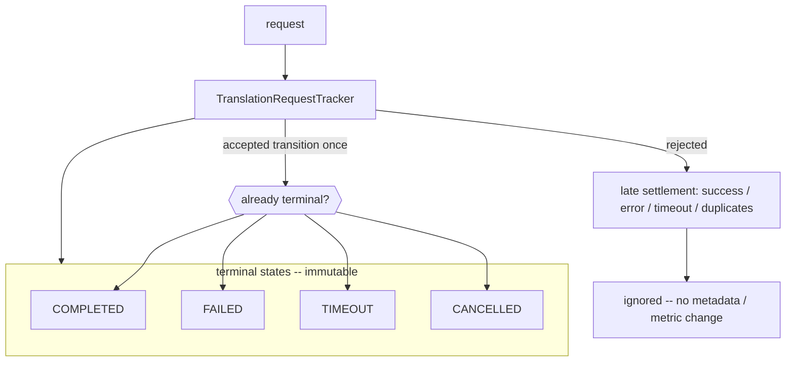
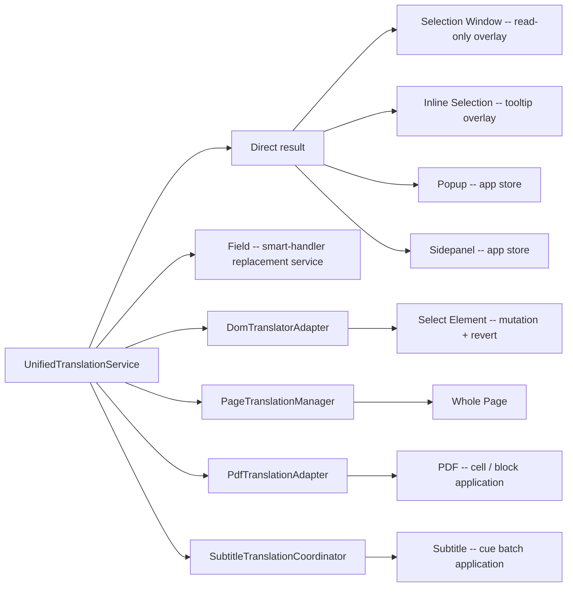

# Translation System — Architecture Diagrams

Mermaid diagrams for the current translation runtime. These **illustrate ownership and flow only**; they do not restate the contract text.

- Contract (details): [FEATURE_CONTRACTS.md](../contracts/FEATURE_CONTRACTS.md), [PROVIDER_CONTRACT.md](../contracts/PROVIDER_CONTRACT.md), [CONVERSATION_CONTRACT.md](../contracts/CONVERSATION_CONTRACT.md), [TRANSLATION_IDENTITY_AND_FRAGMENT_CONTRACT.md](../contracts/TRANSLATION_IDENTITY_AND_FRAGMENT_CONTRACT.md).
- Architecture guide: [TRANSLATION_SYSTEM.md](TRANSLATION_SYSTEM.md).

---

## 1. End-to-End Translation Pipeline



No automatic cross-provider fallback node exists: `ProviderCoordinator` orchestrates a single selected provider; a failure is a typed terminal, not a switch to another provider.

---

## 2. Provider Execution / Retry Ownership



Separate bounded mechanisms — do not merge them: **retry** (`QueueManager`) is the same item, **key failover** (`ProviderRequestEngine`/`ApiKeyManager`) is the same provider's keys, **structured recovery** (`BaseAIProvider`) is one provider-local pass that is selective when mapping is safe and full sequential otherwise. `AIResponseParser` parses and produces facts; `TranslationContractValidator` decides semantic validity; recovery merges or replaces the candidate before final validation and stream visibility. No single cross-layer total-attempt guard exists. Recovery failure produces a typed provider failure; no second recovery pass or source fallback is introduced.

---

## 3. AI Conversation Lifecycle

```mermaid
stateDiagram-v2
    [*] --> PrimaryCall
    PrimaryCall --> Staged: stage(candidate)
    Staged --> Parsed: parse / validate
    Parsed --> Crit{accepted?}

    Crit --> Discard: contract violation
    Discard --> Recovery
    Recovery --> Done: return result
    Done --> [*]: no conversation commit

    Crit --> Commit: yes (abort check)
    Commit --> [*]: commit once

    Parsed --> Fail: failure / timeout / cancel
    Fail --> Discard2: discard
    Discard2 --> [*]: no commit

    state Late {
        [*] --> Ignored: late settlement after terminal
    }
```

`STRUCTURED_RECOVERY` never participates in conversation history. A timed-out/cancelled request discards its candidate; the external outcome stays `TRANSLATION_TIMEOUT` or `USER_CANCELLED`. Recovery may be selective or full per provider policy; either way, no history entry is committed.

---

## 4. Identity and Fragment Lifecycle



Identity follows `uid ?? cellId ?? i ?? id ?? blockId` (nullish, `0` valid). Same-batch duplicate aborts the batch; cross-batch suppresses the later occurrence (request-local, no global cache).

---

## 5. Error / Terminal State Flow



Terminal states are immutable. `TRANSLATION_TIMEOUT` and `USER_CANCELLED` are distinct; a cancel after a timeout is suppressed, and late settlements cannot replace terminal state or trigger delivery.

---

## 6. Feature Routing Overview



High-level mutation owners. See [FEATURE_CONTRACTS.md](../contracts/FEATURE_CONTRACTS.md) for per-mode mutation/revert details.

---

## Cross-References

- [TRANSLATION_SYSTEM.md](TRANSLATION_SYSTEM.md) — architecture guide and runtime freeze.
- [../contracts/FEATURE_CONTRACTS.md](../contracts/FEATURE_CONTRACTS.md) — feature observable contracts.
- [../contracts/PROVIDER_CONTRACT.md](../contracts/PROVIDER_CONTRACT.md) — provider/retry/health/stats contracts and structured-recovery guarantees.
- [../contracts/CONVERSATION_CONTRACT.md](../contracts/CONVERSATION_CONTRACT.md) — conversation candidate lifecycle and recovery history exclusion.
- [../contracts/TRANSLATION_IDENTITY_AND_FRAGMENT_CONTRACT.md](../contracts/TRANSLATION_IDENTITY_AND_FRAGMENT_CONTRACT.md) — identity / fragment contract.
- [../TRANSLATION_PROVIDER_LOGIC.md](../TRANSLATION_PROVIDER_LOGIC.md) — structured-response execution and recovery policy.
- [../../adr/ADR-015-translation-outcome-semantics.md](../../adr/ADR-015-translation-outcome-semantics.md) — architectural decisions and deferred outcome adoption.
